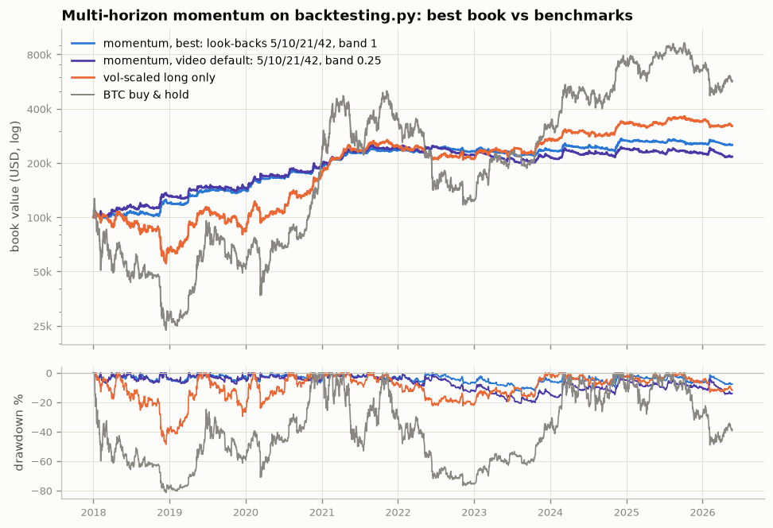
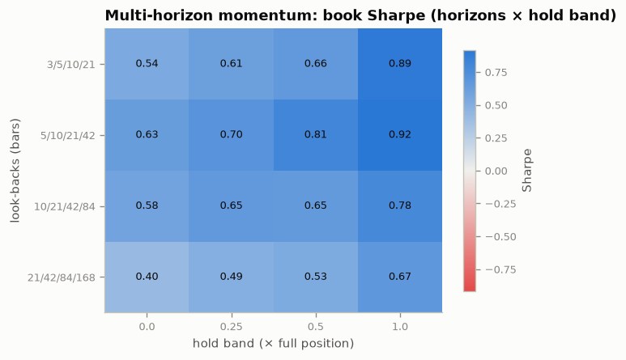

# pl.backtesting.py — four trading strategies, backtested honestly

A research fork of [backtesting.py](https://github.com/kernc/backtesting.py)
that bundles **four strategy studies** — three research labs with their own
packages, vendored data, tests and write-ups, plus a self-contained crypto
momentum example — in one [uv](https://docs.astral.sh/uv/)-managed project
on **Python 3.13**:

| Strategy | What it trades | Where it's tested | Verdict (details below) |
|---|---|---|---|
| **Pairs trading** (`examples/pairs_trading/`) | the spread between two cointegrated assets, walk-forward | crypto, US stocks, forex, commodities, cross-asset; 1971→2026 | only the WTI/Brent oil spread survives out of sample; famous stock/FX/crypto pairs don't |
| **Poor Man's Covered Call** (`examples/pmcc/`) | deep-ITM LEAPS call + short monthly call | 17 French large caps, 2000→2015, synthetic option chains | covered-call-like returns with roughly half the drawdown, ~2 pp/yr less than the covered call |
| **Index inclusion** (`examples/index_inclusion/`, `bot/`) | stocks about to be added to a rules-based index | synthetic point-in-time market with an FTSE-100 rulebook; live bot for S&P 500 / Nasdaq-100 / FTSE 100 / DAX 40 | the machinery captures the planted index effect; the real edge today is small in mega caps |
| **Multi-horizon momentum** (`examples/momentum_strategy.py`) | Man AHL's trend rule — four look-back signs, every coin sized to the same risk | 12 cryptos, daily 2018→2026, next-open fills, 15 bp per side | Sharpe 0.9 net with a 12% drawdown and no BTC beta; the drift-hold band matters more than the look-backs, and costs take a fifth of the edge |

**All four strategies run on the backtesting.py framework** — one
`Strategy` subclass per script in `examples/`, executed, costed, optimized
(`bt.optimize`, or a book-level grid where the strategy is a multi-asset
book) and charted by the framework, with the strategy-specific machinery
(cointegration statistics, option pricing, the index simulator) living in
support packages under `examples/`. Each script finds and plots the
**best-performing configuration** ([examples/README.md](examples/README.md)):

| Strategy | Best configuration (`bt.optimize`) | Sharpe: best / default / benchmark | Does it hold up? |
|---|---|---|---|
| Pairs trading — WTI/Brent, walk-forward OOS | enter 2.5σ, exit 0, 20-bar z-window | **0.52** / 0.35 / two-leg engine agrees on 79 of 79 trades | same 8% drawdown, fewer trades; default has NW t ≈ 3 |
| Poor Man's Covered Call — 10 French large caps | step aside at realized vol > 0.35, back in < 0.30 | **0.77** / 0.73 always-in / covered call 0.66, buy & hold 0.37 | the filter loses on 10/10 single names — always-in is the answer |
| Index inclusion — synthetic SIX 100 | hold ≤ 25, buffer 2, hunt 15 d pre-cutoff | **1.39** / 1.27 / — | 0.86 vs 0.86 on fresh market seeds — the peak is noise |
| Multi-horizon momentum — 12 cryptos, 2018–2026 | look-backs 5/10/21/42, hold band 1 (book-level grid) | **0.92** / 0.70 video default / vol-scaled long only 0.57, BTC 0.26 | the video's look-backs win at every band; 1.02 → 0.85 from 0 to 25 bp of costs |

| Pairs trading | Poor Man's Covered Call | Index inclusion | Multi-horizon momentum |
|---|---|---|---|
|  |  |  |  |
|  |  |  |  |

## Quickstart

```bash
uv sync                                   # Python 3.13 env from uv.lock (uv fetches the interpreter)
uv run pytest                             # all strategy unit tests (pairs, pmcc, bot)
uv run python -m backtesting.test         # the upstream library's own suite

uv run python examples/pairs_trading_strategy.py     # pairs on the framework: rank, optimize, plot
uv run python examples/pmcc_strategy.py              # PMCC index + regime filter on the framework
uv run python examples/index_inclusion_strategy.py   # index inclusion on the framework
uv run python examples/momentum_strategy.py          # multi-horizon momentum on 12 cryptos

uv run pairs all                          # full five-asset-class pairs study -> examples/research/reports/report.md
uv run pmcc all                           # full PMCC headline + 800-run sensitivity -> examples/pmcc/results/
uv run inclusion-bot selftest             # offline demo cycle of the Telegram bot
```

Everything needed to reproduce every number is in the repository (vendored
daily panels, ~5 MB for pairs, ~300 KB for PMCC; the index study simulates its
market) — no API keys or network access required. Add `--quick` to any example
for a small smoke run.

## The four strategies

### 1. Pairs trading across asset classes — `examples/pairs_trading_strategy.py`

Buy one asset, short its statistical twin when the spread is stretched, bet on
convergence. The classic Engle-Granger / z-score version of the strategy,
rebuilt with the discipline the literature demands — **walk-forward
everything** (hedge ratio, cointegration gate and z-parameters estimated on a
252-day formation window, traded on the next 63 days), next-close execution,
per-leg costs, a proper two-leg engine, deflated-Sharpe grids — and run on real
daily data: 13 cryptos, 505 S&P 500 names, 11 currencies, WTI/Brent/gas, and
cross-asset pairs (petro-currency, BTC vs tokenized gold).

**Findings** ([full report](examples/research/reports/report.md)): once the future is
kept out of the estimation, the formation-window cointegration gate opens on
only 4–12% of windows for famous stock/FX/crypto pairs — the test's own 5%
false-positive rate (Clegg 2014). The one robust survivor is **WTI/Brent**:
out-of-sample Sharpe 0.39, Newey-West t = 3.3, +94 bp per round trip over 35
years, deflated-Sharpe probability 0.97, mostly before the 2011 Cushing break.
Daily crypto pairs lose money even before costs (top-3 portfolio CAGR −24%,
short-leg blowups in alt manias); a re-selected top-10 S&P 500 pair portfolio
nets a Sharpe of 0.02 (the Do & Faff decay); same-close execution doubles
measured Sharpe (Gatev-Goetzmann-Rouwenhorst's "wait one day" artifact,
reproduced).

**On the framework:** `examples/pairs_trading_strategy.py` feeds each pair
to backtesting.py as one synthetic instrument — per walk-forward window the
hedged spread `A − β·B` in window-normalized dollars, β fitted on the
formation window only — so a position of N units is exactly the two-leg
trade (its P&L reproduces the two-leg engine's to the trade: 79 vs 79 trades
on WTI/Brent). Per-leg costs go through a commission callback, the z-score
rule is `PairsTrading.next()`, and `bt.optimize` sweeps the thresholds.
Support package `examples/pairs_trading/`: `data.py` (vendored panels),
`stats.py` (Engle-Granger, ADF, half-life, Hurst, Kalman hedge), `signals.py`,
`engine.py` (the independent two-leg engine used as cross-check),
`walkforward.py`, `screening.py`, `metrics.py` (Newey-West, deflated Sharpe),
`experiments.py`, `cli.py` (`pairs`). Data provenance and licenses: [examples/research/data/SOURCES.md](examples/research/data/SOURCES.md)
(the crypto panel is Coin Metrics community data, CC BY-NC 4.0).

### 2. Poor Man's Covered Call — `examples/pmcc_strategy.py`

Replace the 100 shares of a covered call with a deep-in-the-money LEAPS call
(~0.80 delta, 18–24 months out) and sell the same ~0.25-delta monthly call
against it, rolling both legs mechanically. Backtested on 17 CAC 40 large caps
over 2000–2015 with **synthetic Black-Scholes option chains** (no free
historical Euronext chains exist), a volatility-risk-premium model driven by
VIX/realized vol, dividends, EUR rates, French FTT, spreads and commissions —
against covered-call, buy-and-hold and LEAPS-only benchmarks priced with the
same model, plus an 800-run sensitivity grid.

**Findings** ([examples/pmcc/README.md](examples/pmcc/README.md), [results](examples/pmcc/results/RESULTS.md)):
equal-weight portfolio of the 10 most option-liquid names, net of costs —
PMCC CAGR 12.9% with a −23% max drawdown vs covered call 16.5% / −41% and buy
& hold 11.1% / −50%. The PMCC held up structurally through two −50% bear
markets, but French dividend yields hand the classic covered call ~2 pp/yr
more; everything rides on implied vol trading rich to realized; the leveraged
sizing variant is a ruin machine (−58% portfolio, −95% single-name).
`examples/pmcc/live/` holds a paper-trading executor that reuses the same
decision code.

**On the framework:** backtesting.py cannot hold option legs, so
`examples/pmcc_strategy.py` prices the mechanical package into a daily
total-return index per stock with the `pmcc` engine (the CBOE-BXM idea) and
the framework trades that index: `PMCCRegime` steps aside when the
underlying's realized volatility spikes and re-enters when it calms,
`bt.optimize` finds the thresholds, `MultiBacktest` checks them name by name,
and the covered-call and buy-and-hold indices are benchmarked the same way.

### 3. Index inclusion — `examples/index_inclusion_strategy.py`, `bot/`

When a stock is added to a major index, every tracker must buy it by the
effective date; rank-based rulebooks (FTSE 100, Nasdaq-100, Russell) make the
additions **computable before they are announced**. The tutorial notebook
([doc/examples/Index Inclusion Strategy.py](doc/examples/Index%20Inclusion%20Strategy.py))
builds a synthetic point-in-time market of 220 stocks with a fictional
"SIX 100" index under the FTSE 100 rulebook, injects a 1990s-sized index
effect, screens weekly without look-ahead, and trades one stock at a time
through `backtesting.py` on a stitched tape. `examples/index_inclusion_strategy.py`
is that strategy on the framework, with `bt.optimize` over the holding period
and a fresh-seed generalization check; `examples/index_inclusion/` is the
simulator and screener as a package; `bot/` (`inclusion-bot`, a uv workspace
member) applies the same screens to live data and pushes buy/sell signals to
Telegram ([bot/README.md](bot/README.md)).

**Findings**: the screener captures almost exactly the planted ~5% effect
(high win rate, ~25% exposure, every position closed within a month); the
holding-period knob plateaus once the effective day is reached, and demanding
a deeper prediction buffer only forfeits trades. On today's US mega caps the
real announcement-to-effective effect is mostly arbitraged away
(Greenwood & Sammon 2025); smaller and less-arbitraged indices retain more.

### 4. Multi-horizon momentum — `examples/momentum_strategy.py`

The trend rule Man AHL describes (Moskowitz, Ooi & Pedersen's *Time Series
Momentum*, 2012; Hurst, Ooi & Pedersen's 140 years of evidence): for
look-backs of one week, two weeks, one month and two months take the sign of
today's close minus the close that long ago; sum the four signs into a score
from −4 to +4; size every coin to the same risk (`score / 4 × target risk /
realized vol`); decide on the close, fill at the next open (the same price in
a market that never closes) with fees and slippage; hold small drifts of the
target rather than trade them. Run on the vendored Coin Metrics daily data
for the panel's twelve non-stablecoin assets from 2018 — the video's
monthly re-selection by dollar volume needs volume the panel does not have.

**Findings** ([examples/README.md](examples/README.md#4-multi-horizon-momentum--momentum_strategypy)):
with the video's look-backs and the widest hold band the book earns a
**Sharpe of 0.92 net of 15 bp per side (CAGR 11.6% at 12.7% vol, 12.5%
drawdown, 32% winners, correlation −0.08 to BTC, monthly skew +1.6)**;
the video reports the same shape at a smaller risk budget (Sharpe ≈ 1,
CAGR 7.3%, vol 7.6%, 29% winners). It made +19% in 2018 and −1% in 2022 while
BTC lost 73% and 64%, and +1% in 2023 while BTC gained 156%. The hold band
is where the money is — rebalancing every 25% drift costs 28% of the final
equity and a Sharpe of 0.70 — and costs are the whole story of the edge
(1.02 → 0.85 from 0 to 25 bp per side). The score really does predict the
next day (t = 2.6 clustered by day, 3.0 after BTC beta; the video's 2.9/2.1),
almost entirely from the +4 bucket.

**On the framework:** every coin is one `FractionalBacktest` sleeve running
`MultiHorizonMomentum` (the video's rule in `next()`); the book is the sum of
the sleeves' P&L on one capital base and its statistics come from the
framework as an always-in index through `Backtest`. The horizon set × hold
band grid runs every sleeve per cell and is judged at the book level; the
per-coin optima that `bt.optimize` would return coin by coin are read off the
same runs (they spread over seven cells for twelve coins). The BTC sleeve's
interactive tearsheet is `examples/figures/momentum_tearsheet.html`.

## Layout

```
backtesting/                    the upstream backtesting.py library (kept working; AGPL-3.0)
examples/
  pairs_trading_strategy.py     pairs trading on the framework (rank, optimize, plot)
  pmcc_strategy.py              PMCC index + regime filter on the framework
  index_inclusion_strategy.py   index inclusion on the framework
  momentum_strategy.py          multi-horizon crypto momentum on the framework (sleeves, book, grid)
  figures/, tables/             generated best-configuration graphs and tables
  pairs_trading/                pairs support package (stats, two-leg engine, data, `pairs` CLI)
  pmcc/                         PMCC support package (option pricing/engine, data/, results/, live/)
  index_inclusion/              index-inclusion support package (market simulator, screener)
  research/                     pairs vendored data + generated report
  scripts/                      data fetch/build scripts for the vendored pairs panels
bot/                            inclusion-bot: Telegram index-inclusion signals (uv workspace member)
doc/examples/                   upstream tutorials + the Index Inclusion Strategy notebook
tests/                          test suites (plus examples/pmcc/test_pmcc.py and bot/tests)
```

## Development

```bash
uv sync --extra test --extra doc     # everything incl. the library's test/doc extras
uv run flake8 backtesting examples tests
uv run ruff check examples tests
uv run mypy --no-warn-unused-ignores backtesting
uv run doc/build.sh                  # API docs + rendered example notebooks
```

CI (`.github/workflows/ci.yml`) runs lint, the library suite on 3.13/3.14, the
strategy test suites, the bot self-test, and a `--quick` smoke run of each
example script.

## Relationship to upstream

This is a fork of [kernc/backtesting.py](https://github.com/kernc/backtesting.py)
(AGPL-3.0). The original README is preserved at
[doc/README_upstream.md](doc/README_upstream.md); the library itself is
unchanged except for packaging (PEP 621 / uv, Python ≥ 3.13) and a few small
fixes listed in the [CHANGELOG](CHANGELOG.md). It still works exactly as
documented upstream:

```python
from backtesting import Backtest, Strategy
from backtesting.lib import crossover

from backtesting.test import SMA, GOOG


class SmaCross(Strategy):
    def init(self):
        price = self.data.Close
        self.ma1 = self.I(SMA, price, 10)
        self.ma2 = self.I(SMA, price, 20)

    def next(self):
        if crossover(self.ma1, self.ma2):
            self.buy()
        elif crossover(self.ma2, self.ma1):
            self.sell()


bt = Backtest(GOOG, SmaCross, commission=.002,
              exclusive_orders=True)
stats = bt.run()
bt.plot()
```

Results in:

```text
Start                     2004-08-19 00:00:00
End                       2013-03-01 00:00:00
Duration                   3116 days 00:00:00
Exposure Time [%]                       94.27
Equity Final [$]                     68935.12
Equity Peak [$]                      68991.22
Return [%]                             589.35
Buy & Hold Return [%]                  703.46
Return (Ann.) [%]                       25.42
Volatility (Ann.) [%]                   38.43
CAGR [%]                                16.80
Sharpe Ratio                             0.66
Sortino Ratio                            1.30
Calmar Ratio                             0.77
Alpha [%]                              450.62
Beta                                     0.02
Max. Drawdown [%]                      -33.08
Avg. Drawdown [%]                       -5.58
Max. Drawdown Duration      688 days 00:00:00
Avg. Drawdown Duration       41 days 00:00:00
# Trades                                   93
Win Rate [%]                            53.76
Best Trade [%]                          57.12
Worst Trade [%]                        -16.63
Avg. Trade [%]                           1.96
Max. Trade Duration         121 days 00:00:00
Avg. Trade Duration          32 days 00:00:00
Profit Factor                            2.13
Expectancy [%]                           6.91
SQN                                      1.78
Kelly Criterion                        0.6134
_strategy              SmaCross(n1=10, n2=20)
_equity_curve                          Equ...
_trades                       Size  EntryB...
dtype: object
```

None of this is investment advice; every study documents the assumptions
(synthetic options, indicative marks, planted effects, survivorship) that its
numbers rest on.
