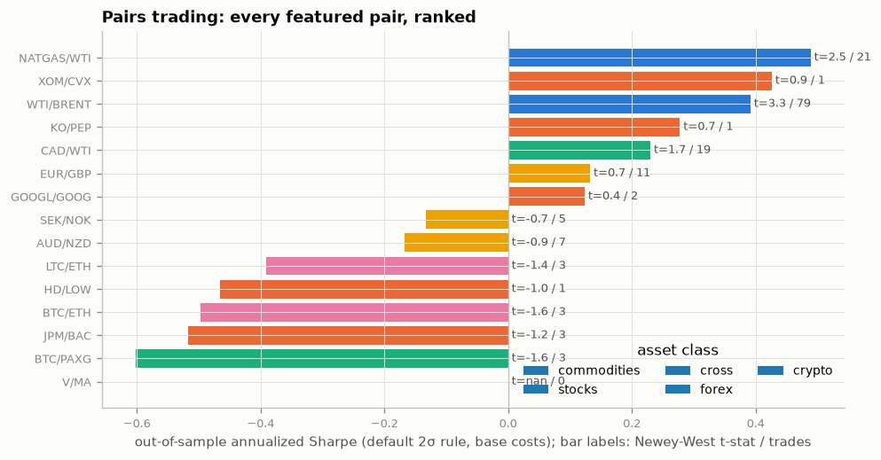
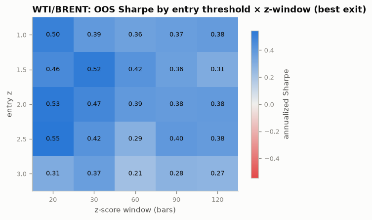
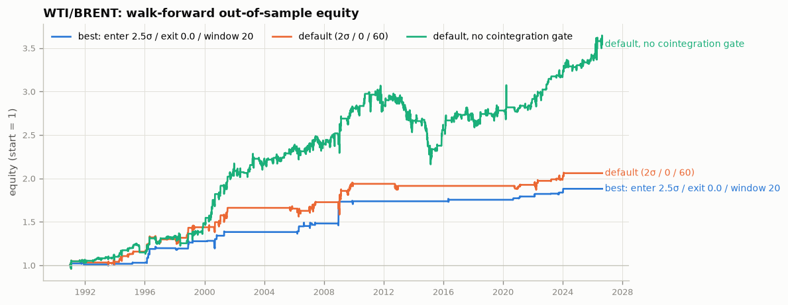
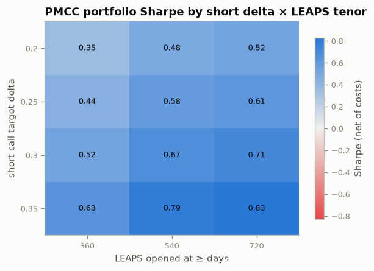
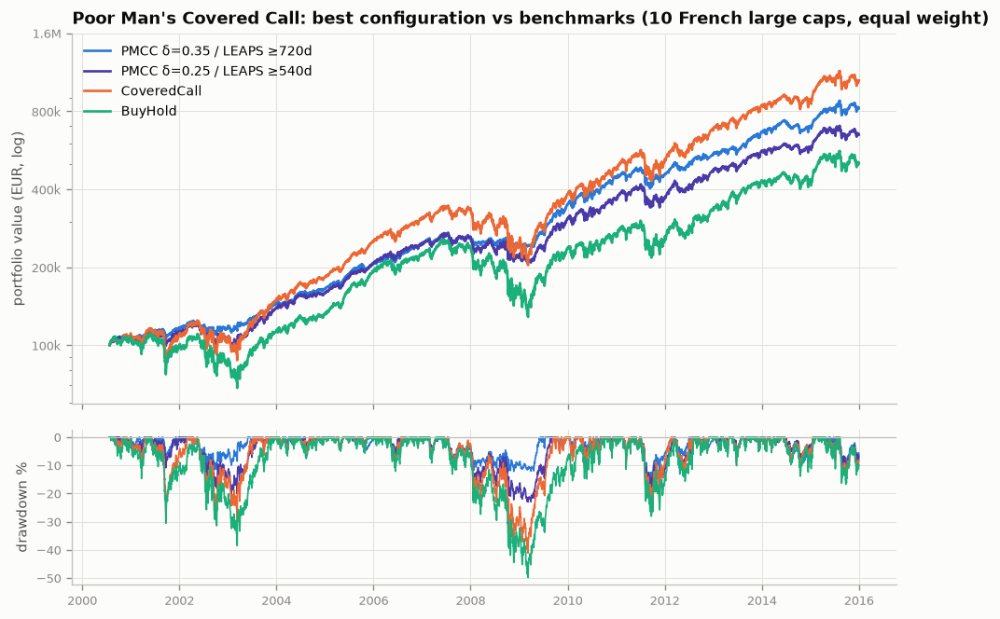
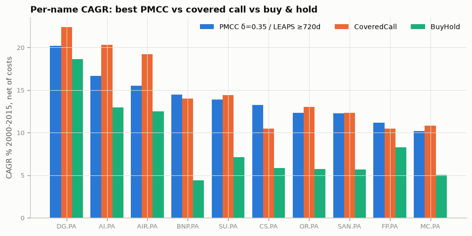
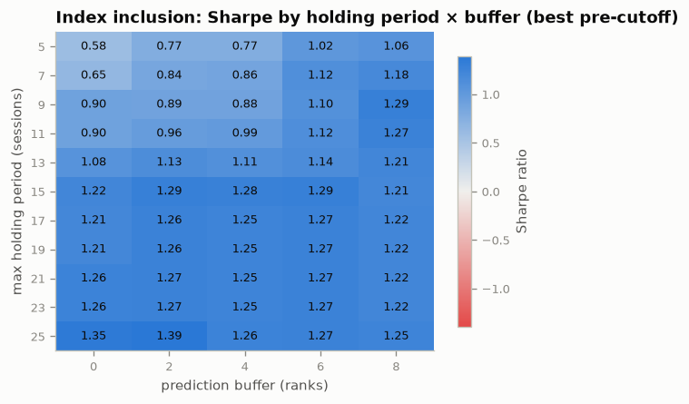
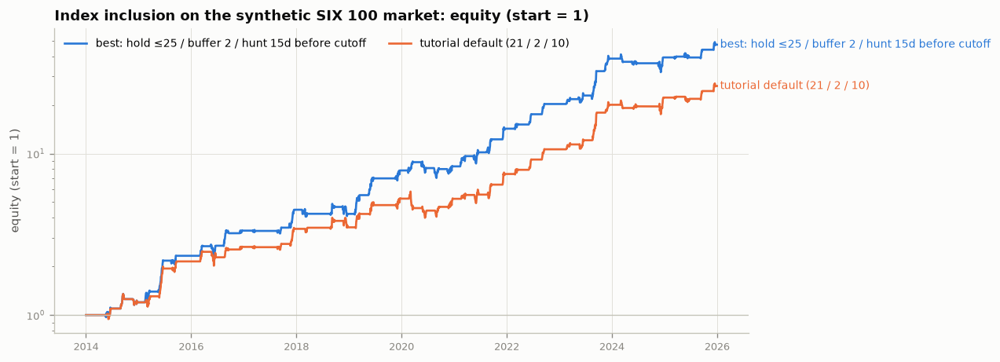
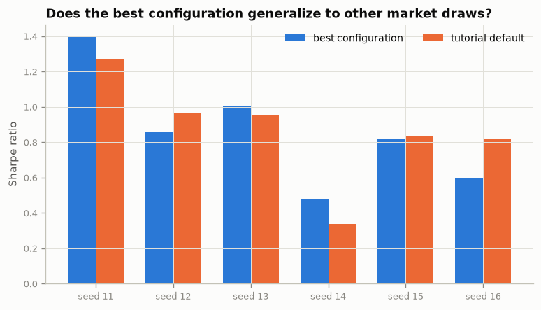

# Strategy examples — best-performing configurations

One runnable script per strategy. Each sweeps the strategy's main parameters,
prints the ranked configurations, saves the tables to `examples/tables/` and
the graphs to `examples/figures/`, and reports the best configuration — plus
the check that matters most: whether "best" survives outside the sample it was
picked on.

```bash
uv run python examples/run_pairs_trading.py      # ~4 min
uv run python examples/run_pmcc.py               # ~2 min (multi-process)
uv run python examples/run_index_inclusion.py    # ~2 min
```

Add `--quick` for a small smoke run (what CI executes).

## 1. Pairs trading — `run_pairs_trading.py`

Every featured pair of the five-asset-class study is backtested walk-forward
under the literature-default rule (enter 2σ / exit 0 / stop 4σ, 252-day
formation, 63-day trading, next-close execution, per-leg costs) and ranked;
the most *statistically robust* pair (highest Newey-West t-statistic among
pairs with ≥ 20 trades — raw Sharpe would pick a 21-trade fluke) is then swept
over entry threshold × exit threshold × z-score window.

| Ranking | Sweep | Best vs default |
|---|---|---|
|  |  |  |

**Most robust pair: WTI/Brent** (out-of-sample Sharpe 0.39, Newey-West
t = 3.3, 79 trades over 35 years under the default rule; NATGAS/WTI posts a
higher raw Sharpe of 0.49 on only 21 trades, t = 2.5). The threshold sweep on
WTI/Brent is reported by the script and in `tables/pairs_best_grid.csv`.

## 2. Poor Man's Covered Call — `run_pmcc.py`

The two structural knobs of the PMCC — the short call's target delta (how
much premium vs how much upside you give away) and how far out the LEAPS is
opened — are swept on the 10 most option-liquid French large caps
(2000–2015, synthetic option chains, net of costs), aggregated into an
equal-weight portfolio and compared with the covered call and buy & hold
priced under the same model.

| Sweep | Best vs benchmarks | Per name |
|---|---|---|
|  |  |  |

**Best configuration: short δ = 0.35, LEAPS opened ≥ 720 days out** — portfolio
Sharpe **0.83** (CAGR 14.6%, max drawdown −17%), against the study's default
δ = 0.25 / 540 d at Sharpe 0.58 (CAGR 12.9%, −23%), the covered call at 0.62
(CAGR 16.5%, −41%) and buy & hold at 0.36 (11.1%, −50%). The grid is monotone:
every step toward more premium (higher short delta) and longer LEAPS tenor
raises the Sharpe, because the extra premium and the slower theta of a longer
LEAPS both cut drawdowns. The covered call still earns more raw CAGR — French
dividend yields are its structural advantage — but the best PMCC gets within
2 pp/yr of it with less than half the drawdown. Caveat carried over from the
PMCC study: every option price here is synthetic, so treat the *ordering* of
configurations as more reliable than the absolute Sharpe levels.

## 3. Index inclusion — `run_index_inclusion.py`

On the tutorial's synthetic point-in-time market (220 stocks, an FTSE-100-style
rulebook, a planted ~5% index effect), the strategy's three knobs are swept:
how many sessions before a review cutoff to start hunting, how deep inside the
entry band a candidate must rank (the prediction buffer), and the maximum
holding period. The best configuration is then **re-run on five fresh market
seeds** next to the tutorial default.

| Sweep | Best vs default | Fresh market seeds |
|---|---|---|
|  |  |  |

**Best configuration on the tutorial's seed: hold ≤ 25 sessions, buffer 2,
hunt 15 days before the cutoff** — Sharpe **1.39** (annualized return 36%,
43 trades, 79% win rate) vs the tutorial default (21 / 2 / 10) at 1.27. The
heatmap shows the real structure: Sharpe plateaus once the holding period is
long enough to reach the effective day (~15 sessions), and a deeper buffer
only forfeits trades. **On fresh market seeds the "best" configuration and
the default are indistinguishable** (mean Sharpe 0.86 vs 0.86; the best wins
on 3 of 6 seeds) — the 1.39 was fitted to one draw of the simulator. That is
the honest lesson of parameter optimization: the plateau is real, the peak is
noise. The absolute Sharpe levels are those of a market with a 1990s-sized
planted effect; today's real edge in mega-cap indices is much smaller.
