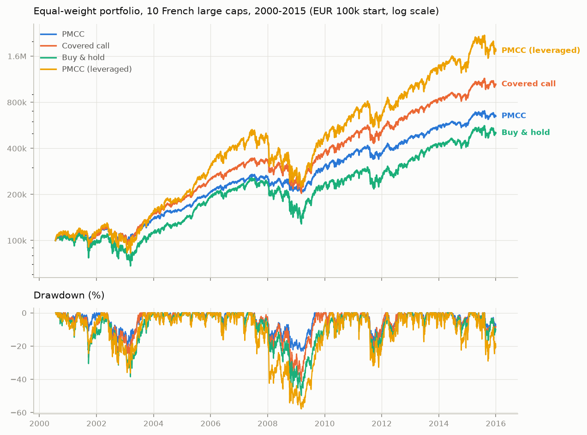
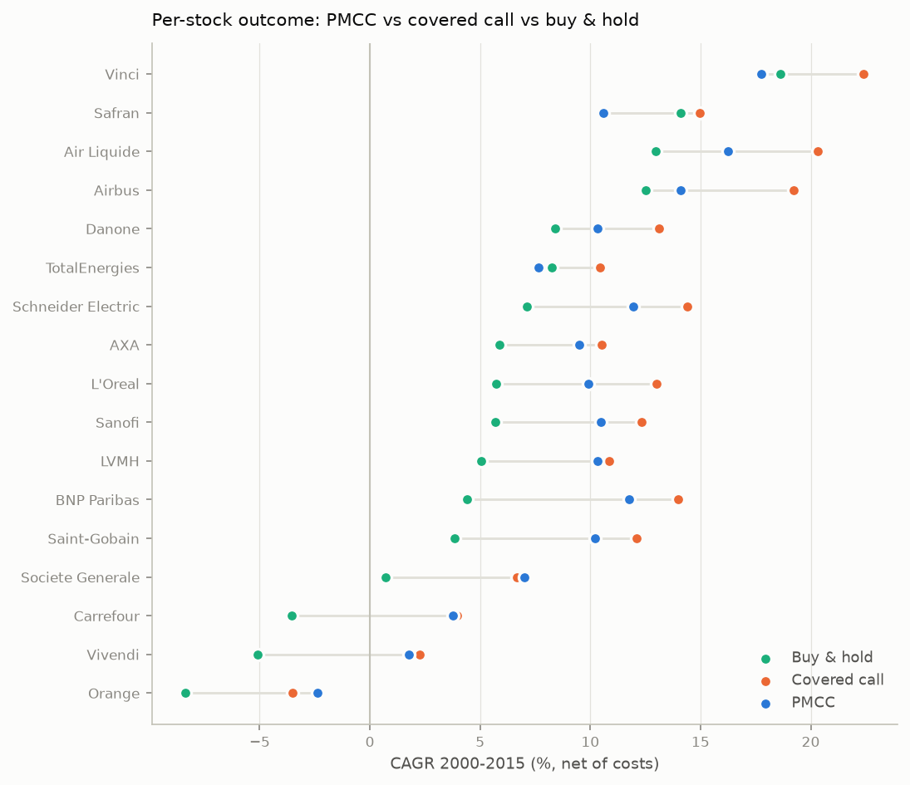
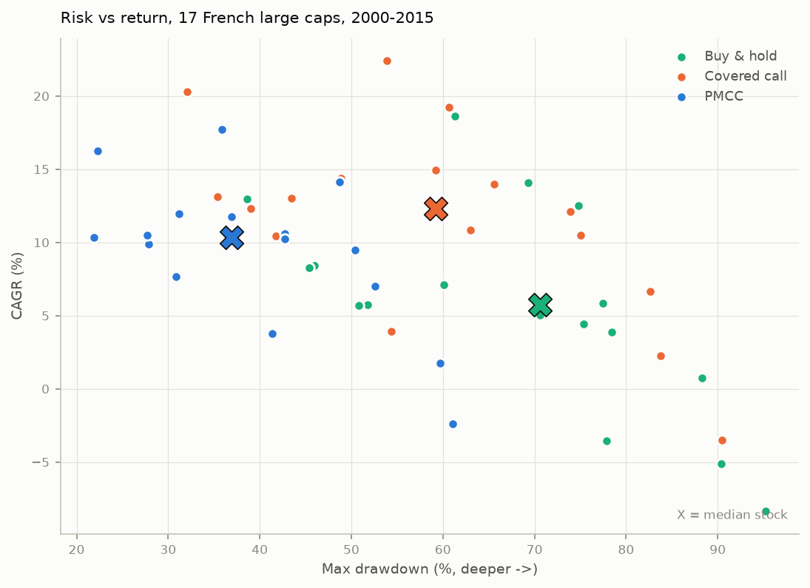
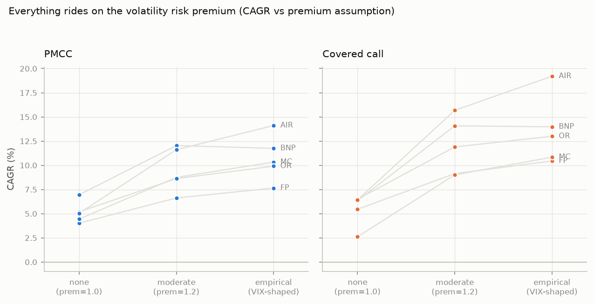

# Poor Man's Covered Call on French large caps — backtest & execution scaffold

A self-contained research module answering: **would running a Poor Man's
Covered Call (PMCC) on major French stocks have been worth it, and should you
automate it?** It backtests the strategy on 17 CAC 40 large caps over
2000–2015 against honest benchmarks, stress-tests every fragile assumption,
and ships a paper-trading execution scaffold that reuses the exact same
decision code.

*(This lives in a fork of [backtesting.py](https://github.com/kernc/backtesting.py),
but is deliberately standalone: multi-leg option strategies with two rolling
expiries don't fit the single-instrument OHLC model of the host library.)*

## The strategy

A PMCC replaces the 100 shares of a covered call with a **deep-in-the-money
LEAPS call** (~0.80 delta, 18–24 months out, costing ~25–35% of the share
price) and sells the same **~0.25-delta monthly call** against it:

- short call is rolled at every monthly expiry (assigned ITM or expired);
- LEAPS is rolled when < 90 days remain (before theta decay accelerates);
- the ~2/3 of capital not tied up in the LEAPS sits in cash earning interest;
- default sizing: one PMCC unit per 100 shares the same equity could buy
  (`match_stock`), i.e. the honest like-for-like replacement of a covered
  call. `budget` sizing (75% of equity in LEAPS ≈ 2.5–3× delta leverage) is
  also simulated — see the verdict for why you probably shouldn't.

## TL;DR — the verdict

Equal-weight portfolio of the 10 most option-liquid names, 2000–2015, €100k,
net of costs, default assumptions:

| | PMCC | Covered call | Buy & hold | PMCC leveraged | LEAPS only |
|---|---|---|---|---|---|
| CAGR | **12.9%** | 16.5% | 11.1% | 20.3% | 7.1% |
| Volatility | **14.5%** | 19.8% | 24.2% | 32.3% | 19.3% |
| Max drawdown | **−23%** | −41% | −50% | −58% | −37% |
| Worst year | **−16%** | −27% | −33% | −42% | −25% |
| Sharpe | 0.58 | 0.62 | 0.36 | 0.58 | 0.21 |

1. **The PMCC held up structurally.** Same-size PMCC delivered covered-call-like
   returns with roughly **half the drawdown** — through two −50% bear markets
   (2001–03, 2008–09) its defined-risk LEAPS floor plus the cash buffer kept
   the worst portfolio drawdown at −23%. It beat buy & hold on return in 14 of
   17 single names and had a smaller max drawdown in 17 of 17 (also smaller
   than the covered call's in 17 of 17).
2. **The classic covered call earned more.** Across the assumption grid the
   covered call beat the PMCC's CAGR in ~80% of cells (median gap ≈ 1.9 pp/yr).
   French large caps pay big dividends (3–5%+), which the covered call
   receives and the PMCC forgoes — a structural headwind for PMCC *in France
   specifically*. PMCC is the better *risk-adjusted-per-euro-at-risk*
   structure; the covered call is the better raw earner, especially on
   high-yield names (TotalEnergies, Orange, AXA).
3. **Everything rides on the volatility risk premium.** With options priced at
   *fair* value (implied = realized, `prem=1.0`), both strategies collapse to
   roughly buy-and-hold returns: selling fairly-priced calls adds nothing but
   friction. The excess return exists **iff** single-stock implied vol trades
   rich to realized — well documented empirically, but the single biggest
   uncertainty in any synthetic-options backtest, including this one.
4. **Do not run the leveraged version.** `budget` sizing headline-compounds at
   20% but hit −58% portfolio and −95% single-name (Société Générale)
   drawdowns, with forced margin-call deleveraging. A crash takes the deep-ITM
   LEAPS to ~zero; 3× units means the account follows.
5. **Interest on the cash buffer mattered**: ≈ €102k of the average PMCC
   single-name P&L over 15.4y came from 2000–2008 EUR rates (2–4.6%). At
   today's ~2% ECB-era rates that pillar half-stands; at 2015–2021 zero rates
   it didn't exist.
6. **Best PMCC candidates**: low-dividend, high-premium growth names (LVMH was
   the only liquid name where PMCC out-earned the covered call outright in
   most cells). Worst: high-dividend defensives.

**Bottom line:** viable as a *risk-managed* equity substitute under the
documented assumptions — expect covered-call-minus-~2pp returns with roughly
half the capital at risk — but the edge is assumption-sensitive, and the
2000–2015 window (rich premia, high rates, two crashes) flattered it. Validate
on paper with real quotes before automating (scaffold in `pmcc/live/`), and
extend the data to the present with `python -m pmcc.fetch_data` on your own
machine.






## Data (and its limits)

| ingredient | source | notes |
|---|---|---|
| Stock prices | [CRAN `qrmdata`](https://github.com/cran/qrmdata) EURO STOXX 50 constituents | 17 French members, daily adjusted closes 2000-01-03 → 2015-12-31, end-anchored. Two unadjusted 4:1 splits repaired (AXA 2001, SocGen 2000); Essilor, Engie, Unibail dropped for data quality; Safran truncated to post-merger (2005-06). See `tools/build_dataset_from_qrmdata.py`. |
| Option prices | **synthetic** (Black-Scholes) | No free historical Euronext option chains exist. See below. |
| EUR rates | EURIBOR-3M annual averages, encoded | interpolated; drives cash interest + pricing. |
| Dividends | per-stock constant yields, encoded | approximate long-run averages (e.g. Total 5.3%, LVMH 1.9%); ±1pp sensitivity swept. |
| Vol premium | VIX ÷ S&P 500 realized vol (from `qrmdata`) | shapes the implied/realized ratio through time; clipped [0.85, 1.6]. |

**The big caveat — synthetic options.** Every option price in this backtest is
modelled: ATM IV = blended realized vol × premium factor, plus a conservative
skew (OTM calls sold *cheaper*, ITM LEAPS bought *dearer* — both against the
strategy) and term-structure blending; European exercise, cash/physical
settlement at expiry-day close, 2% half-spread + €1.75/contract, French FTT on
stock buys. Real chains would differ trade by trade. That is why the
sensitivity grid exists, and why **absolute CAGRs deserve less trust than the
structural comparisons** (PMCC vs covered call vs holding — all priced with
the same model).

Raw prices are reconstructed from the adjusted series via each stock's
dividend yield (so option strikes/moneyness live in realistic price space and
share owners are credited the dividends the option holder forgoes) — the
continuous-dividend approximation, applied consistently in pricing, accrual
and settlement.

## What's in here

```
pmcc/
├── data.py           # universe, dividend/rate tables, raw-price reconstruction
├── pricing.py        # Black-Scholes(q), greeks, IV solver, strike grid, expiry calendar
├── vol.py            # realized-vol blend + synthetic IV surface (premium, skew, term)
├── strategy.py       # PMCC / CoveredCall / BuyHold / LeapsOnly decision cores
├── engine.py         # daily MTM simulator: costs, settlement/assignment, accrual
├── stats.py          # CAGR, Sharpe, drawdowns, yearly returns
├── run_backtest.py   # CLI: headline runs + 800-run sensitivity grid
├── report.py         # charts + RESULTS.md
├── fetch_data.py     # extend data to today with yfinance (run locally)
├── test_pmcc.py      # unit tests (pricing, calendar, engine invariants)
├── data/             # bundled datasets (see provenance above)
├── results/          # generated stats, charts, RESULTS.md
├── tools/            # dataset build script (provenance)
└── live/             # paper-ready execution scaffold — see live/README.md
```

## Reproduce

The repo is [uv](https://docs.astral.sh/uv/)-managed and targets Python ≥ 3.13
— `uv.lock` pins the exact environment these results were produced with
(uv fetches the interpreter automatically if needed):

```bash
uv sync --extra pmcc                       # or: pip install -e '.[pmcc]'
uv run python -m pmcc.test_pmcc            # unit tests
uv run python -m pmcc.run_backtest all     # ~10 min on 4 cores; writes pmcc/results/
uv run python -m pmcc.live.run_live --ticker MC.PA --broker paper   # dry-run the executor
```

Optional extras: `pmcc-fetch` (yfinance, to extend the dataset locally) and
`pmcc-live` (ib_insync, for the Interactive Brokers adapter skeleton).

Key knobs (see `PMCCParams` / `Engine`): `short_target_delta` (0.25),
`leaps_target_delta` (0.80), `leaps_open_min_dte` (540 — 720 tested slightly
better), `defend_delta` (None — the 0.60 defend rule *hurt* in every name
tested), `prem` (`'vix'` | float), `skew_slope` (0.10), spread/commission in
`CostModel`.

## Toward the automated system

The decision core (`strategy.PMCC.decide()`) is shared between the backtest
engine and `pmcc/live/executor.py`, so the logic you backtest is the logic
that would trade. The live scaffold does dry-run and offline-paper loops
today, has an untested Interactive Brokers adapter for Euronext options, and a
step-by-step go-live checklist: **`pmcc/live/README.md`**. Do not skip the
paper-trading months — the first thing to measure there is whether real
spreads and premia resemble the model's.
