# Pairs trading across asset classes — a walk-forward study

*Generated by the `pairs_trading` research lab in this repository
(`uv run pairs all`). Every table and figure is reproducible offline from the
vendored data; see `research/data/SOURCES.md` for provenance.*

Pairs trading buys one asset and shorts a related one when the spread between
them is unusually wide, betting on convergence. This report tests the classic
cointegration flavor of the strategy — Engle-Granger selection, z-score
entries — on real daily data in five settings: **crypto, US stocks, forex,
commodities, and cross-asset pairs**, with the estimation discipline the
literature demands (walk-forward everything, next-close execution, explicit
costs).

## Findings at a glance

*(Numbers refer to the vendored data snapshot; regenerate them with
`uv run pairs all`.)*

1. **Out-of-sample discipline eliminates most of the strategy.** Once the
   hedge ratio, z-parameters and the cointegration test itself are estimated
   only on formation windows, the gate opens on just 4–12% of windows for
   famous pairs in stocks, FX and crypto — indistinguishable from the 5%
   false-positive base rate of the test (Clegg 2014, replicated below in the
   persistence tables: P(pass next | pass now) mostly ≤ 50%). V/MA, one of
   the most correlated pairs in the S&P 500, never passes at all —
   correlation is not cointegration.
2. **The one relationship that genuinely survives is the oil complex.**
   WTI/Brent: Sharpe 0.39, Newey-West t = 3.3, 79 round trips over 35 years,
   +94 bp per trade against a ~20 bp cost hurdle, deflated-Sharpe probability
   **0.97** across the threshold grid, and graceful cost decay (Sharpe 0.27
   at 4× base costs). Its gate persistence (58% conditional re-pass) is the
   only one meaningfully above base rate — and the gate timeline shows it
   trading mostly *before* the 2011 Cushing dislocation, exactly where the
   literature places the structural break.
3. **GGR's "wait one day" reproduced.** Executing on the signal close instead
   of the next close roughly doubles WTI/Brent's Sharpe (0.81 vs 0.39; CAGR
   4.84% vs 2.07%): more than half of the apparent edge at daily frequency is
   bid-ask bounce you cannot collect.
4. **Daily crypto pairs lose money even before costs.** BTC/ETH walk-forward
   Sharpe −0.50 (−0.47 at zero cost); the top-3 re-selected portfolio ends at
   Sharpe −0.60 with CAGR −23.9% and a 94.8% drawdown, with busted slots in
   the 2017 and 2020-21 alt manias — the daily-frequency half of the Fil &
   Kristoufek (2020) result, plus divergence risk in its most violent form.
   A rolling-z stop is no protection there: when the spread trends, its own
   σ expands with it, so the 4σ stop never fires (LTC/ETH's −61% trade ran
   55 days to the window time-stop).
5. **US equity pairs are arbitraged flat.** The top-10 S&P 500 portfolio,
   re-selected every quarter from 505 names, nets Sharpe 0.02 (CAGR 0.0%,
   max DD 1.0%) after 5 bp/side — the Do & Faff (2010/2012) decay, exactly.
   Twenty years of JPM/BAC gives Sharpe 0.18 with 11 trades.
6. **Cross-asset links are real but thin.** The petro-currency pair CAD/WTI
   earns Sharpe 0.23 (t = 1.7, 68% win rate) but dies at 4× costs; BTC/PAXG
   ("digital gold") is firmly negative — Bitcoin does not trade like gold.
7. **The gate buys tails, not Sharpe.** Removing it leaves headline Sharpe
   similar (WTI/Brent 0.42 vs 0.39) but multiplies drawdowns ~3.5×
   (30% vs 9%) and trade counts ~3×: the cointegration filter is a risk
   control more than an alpha source.
8. **Estimator choice is second-order next to regime.** The continuous
   Kalman hedge keeps pairs tradable in far more windows (64% vs 30% for
   WTI/Brent; 59 vs 3 trades on LTC/ETH) with similar per-year returns but
   deeper drawdowns — adaptivity extends the opportunity set, it does not
   manufacture mean reversion.
9. **Nothing here clears the t ≥ 3 bar except WTI/Brent** (t = 3.3, DSR
   0.97). By Harvey-Liu-Zhu standards, every other configuration in this
   study is statistically indistinguishable from noise once selection is
   accounted for. That is the honest headline for daily-frequency pairs
   trading in 2026.

## Methodology

**Spread model.** For legs A and B we fit `ln A = α + β ln B + s` on a
*formation window* and trade the spread `s` over the following *trading
window* (defaults: 252/63 bars, the walk-forward template of Gatev,
Goetzmann & Rouwenhorst 2006). A window is traded only if, on formation data
alone, the pair passes an Engle-Granger cointegration test (MacKinnon
p < 0.05, via `statsmodels.tsa.stattools.coint`) and its spread half-life —
`ln 2 / κ` from the AR(1) fit `Δs_t = a + φ s_{t-1} + ε`, κ = −φ — lies in
[1, 60] bars (the Avellaneda & Lee 2010 style tradability filter). Windows
that fail stay flat but remain in the equity curve (committed capital).

**Signals.** z-score of the spread against a trailing 60-bar mean/std
(strictly causal; a GGR-style variant freezes μ, σ from the formation window).
Enter long (short) the spread at z ≤ −2 (z ≥ +2), exit on reversion through 0,
hard stop at |z| = 4 as a structural-break guard, and force-flat at window
boundaries. After any exit the rule is disarmed until |z| re-enters the entry
band, so a stop is never immediately re-entered.

**Execution and P&L.** The two-leg engine holds `N = equity/(1+β)` dollars of
A against `βN` dollars of B (dollar-neutral in the β-weighted sense, gross =
1× equity), executes on the close one bar *after* the signal (GGR's
"wait one day"; a lag-0 variant quantifies the bounce subsidy), and charges a
per-side proportional cost on every leg's traded notional — 12 bp (crypto),
5 bp (stocks), 2 bp (forex), 5 bp (commodities spot proxies) per side, with
0×/0.5×/2×/4× sweeps. Hedge variants: formation-window OLS (default) and a
Kalman filter (Vₑ = 1e-3 after E. Chan 2013) supplying the *hedge-ratio
path* β_t: one continuous, causal pass over the whole history, initialized by
OLS on the first (never traded) formation window, with the intercept pinned
and δ = 1e-7 — a deliberately slower drift than Chan's δ = 1e-4 because we
filter log prices, and because a fully adaptive (α, β) state whitens its own
innovations and absorbs exactly the mean reversion the strategy trades.
Kalman windows are gated by an ADF test on the filtered spread they trade.

**Statistics.** Sharpe annualized at 252 (365 for crypto) periods; Newey-West
HAC t-statistics on mean daily returns (automatic lag rule); the threshold
grids report a Bailey & López de Prado (2014) *deflated Sharpe probability*
that treats every grid cell as a trial. Per-trade economics are reported in bp
of gross notional against the ≈ 4-per-side-bp round-trip hurdle.

**What this design deliberately avoids**: full-sample hedge ratios and
z-parameters (look-ahead), hand-picked famous pairs presented as performance
(each study screens its whole universe mechanically; famous pairs are shown as
labeled case studies), same-bar execution, and cost-free P&L.


## Headline: all featured pairs, out-of-sample

|            | class       |   sharpe |   cagr_pct |   max_dd_pct |   n_trades |   win_rate_pct |   avg_trade_bp |   nw_tstat |   gate_pass_pct |   years |
|:-----------|:------------|---------:|-----------:|-------------:|-----------:|---------------:|---------------:|-----------:|----------------:|--------:|
| BTC/ETH    | crypto      |    -0.50 |      -1.23 |        13.13 |       3.00 |           0.00 |        -388.97 |      -1.57 |            5.26 |    9.71 |
| LTC/ETH    | crypto      |    -0.39 |     -12.73 |        82.12 |       3.00 |           0.00 |       -3136.27 |      -1.36 |            7.02 |    9.71 |
| KO/PEP     | stocks      |     0.28 |       0.28 |         1.36 |       1.00 |         100.00 |         111.72 |       0.68 |           12.50 |    3.99 |
| XOM/CVX    | stocks      |     0.43 |       0.66 |         1.39 |       1.00 |         100.00 |         265.79 |       0.89 |            6.25 |    3.99 |
| V/MA       | stocks      |   nan    |       0.00 |         0.00 |       0.00 |         nan    |         nan    |     nan    |            0.00 |    3.99 |
| JPM/BAC    | stocks      |    -0.52 |      -1.25 |         5.31 |       3.00 |          33.33 |        -162.97 |      -1.22 |           12.50 |    3.99 |
| HD/LOW     | stocks      |    -0.46 |      -0.69 |         2.97 |       1.00 |           0.00 |        -272.75 |      -0.99 |            6.25 |    3.99 |
| GOOGL/GOOG | stocks      |     0.12 |       0.03 |         0.24 |       2.00 |          50.00 |           4.24 |       0.39 |            8.33 |    2.87 |
| AUD/NZD    | forex       |    -0.17 |      -0.07 |         2.10 |       7.00 |          28.57 |         -26.11 |      -0.90 |            4.72 |   26.50 |
| EUR/GBP    | forex       |     0.13 |       0.07 |         2.24 |      11.00 |          63.64 |          17.11 |       0.71 |            8.49 |   26.50 |
| SEK/NOK    | forex       |    -0.13 |      -0.13 |         7.18 |       5.00 |          20.00 |         -69.22 |      -0.72 |            3.77 |   26.50 |
| WTI/BRENT  | commodities |     0.39 |       2.07 |         8.58 |      79.00 |          67.09 |          94.23 |       3.26 |           30.50 |   35.18 |
| NATGAS/WTI | commodities |     0.49 |       5.18 |        25.26 |      21.00 |          80.95 |         760.76 |       2.50 |           14.91 |   28.41 |
| CAD/WTI    | cross       |     0.23 |       0.29 |         4.80 |      19.00 |          68.42 |          54.96 |       1.72 |            8.51 |   35.19 |
| BTC/PAXG   | cross       |    -0.60 |      -4.66 |        33.02 |       3.00 |           0.00 |       -1092.71 |      -1.64 |            6.06 |    8.08 |

*(Walk-forward, default 2σ rule, base costs, next-close execution. `gate_pass_pct` = share of windows where the formation-period cointegration gate allowed trading.)*

<!-- generated by `pairs run --study crypto` -->

## Crypto

Featured pairs, default rule (enter 2σ / exit 0 / stop 4σ, 252d formation, 63d trading, next-close execution, 12 bp/side):

|         |   sharpe |   cagr_pct |   ann_vol_pct |   max_dd_pct |   n_trades |   win_rate_pct |   avg_trade_bp |   converged_pct |   nw_tstat |   gate_pass_pct |   years |
|:--------|---------:|-----------:|--------------:|-------------:|-----------:|---------------:|---------------:|----------------:|-----------:|----------------:|--------:|
| BTC/ETH |    -0.50 |      -1.23 |          2.43 |        13.13 |       3.00 |           0.00 |        -388.97 |           33.33 |      -1.57 |            5.26 |    9.71 |
| LTC/ETH |    -0.39 |     -12.73 |         25.55 |        82.12 |       3.00 |           0.00 |       -3136.27 |            0.00 |      -1.36 |            7.02 |    9.71 |


### Universe screen (crypto)

13 assets, 2016-01-01 → 2026-05-23; 51 pairs pass the correlation prefilter (≥ 0.5); 8 of them reject the Engle-Granger null at 5%. With 78 candidate pairs, ≈ 4 would pass at 5% by pure chance (Clegg 2014), so this screen is *descriptive*: performance claims come only from the walk-forward section below.

|         |   corr |   eg_pvalue |   beta |   half_life |   hurst |    n_obs |
|:--------|-------:|------------:|-------:|------------:|--------:|---------:|
| BNB/ETH |  0.601 |       0.000 |  1.489 |     126.737 |   0.479 | 3235.000 |
| BNB/BTC |  0.616 |       0.003 |  1.722 |     155.062 |   0.531 | 3235.000 |
| BNB/ETC |  0.514 |       0.010 |  1.474 |     199.354 |   0.480 | 3235.000 |
| ETC/ADA |  0.652 |       0.011 |  0.559 |      80.595 |   0.481 | 3096.000 |
| XMR/BTC |  0.568 |       0.021 |  0.812 |     184.229 |   0.506 | 3796.000 |
| ETH/BTC |  0.655 |       0.026 |  1.157 |     132.445 |   0.553 | 3796.000 |
| LTC/ADA |  0.666 |       0.041 |  0.290 |     101.082 |   0.441 | 3096.000 |
| ETC/DOT |  0.643 |       0.045 |  0.444 |     150.684 |   0.523 | 2103.000 |
| LTC/ETC |  0.603 |       0.064 |  0.807 |     176.632 |   0.486 | 3590.000 |
| BNB/DOT |  0.613 |       0.065 | -0.088 |     176.420 |   0.594 | 2103.000 |

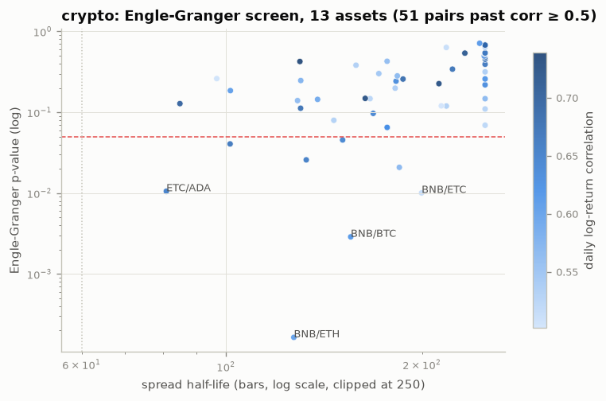


### BTC/ETH

Full-sample descriptives: EG p=0.078, β=0.80, half-life=166.3 bars, Hurst=0.55, n=3796. Walk-forward gate open 5% of 57 windows.


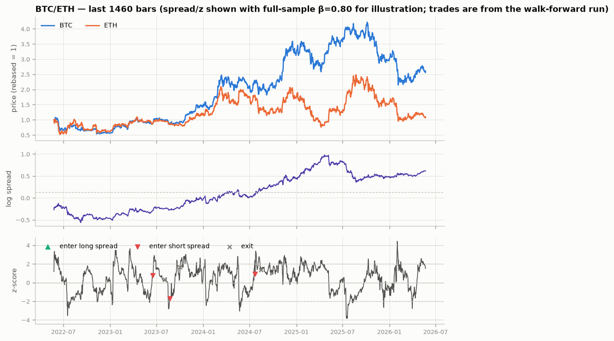


Method variants (all out-of-sample, base costs 12 bp/side):

|                              |   sharpe |   cagr_pct |   max_dd_pct |   n_trades |   win_rate_pct |   avg_trade_bp |   nw_tstat |   gate_pass_pct |   exposure_pct |
|:-----------------------------|---------:|-----------:|-------------:|-----------:|---------------:|---------------:|-----------:|----------------:|---------------:|
| OLS + rolling z (default)    |    -0.50 |      -1.23 |        13.13 |       3.00 |           0.00 |        -388.97 |      -1.57 |            5.26 |           3.13 |
| OLS + frozen z (GGR)         |    -0.30 |      -0.53 |         7.99 |       3.00 |          33.33 |        -169.67 |      -1.18 |            5.26 |           2.43 |
| Kalman hedge                 |    -0.47 |      -5.42 |        46.44 |      37.00 |          51.35 |        -125.02 |      -1.38 |           47.37 |          13.04 |
| same-close execution (lag 0) |    -0.31 |      -0.79 |         9.42 |       3.00 |           0.00 |        -248.88 |      -1.04 |            5.26 |           3.19 |
| no gate                      |    -0.48 |     -18.04 |        89.63 |      71.00 |          43.66 |        -195.85 |      -1.46 |          100.00 |          50.73 |


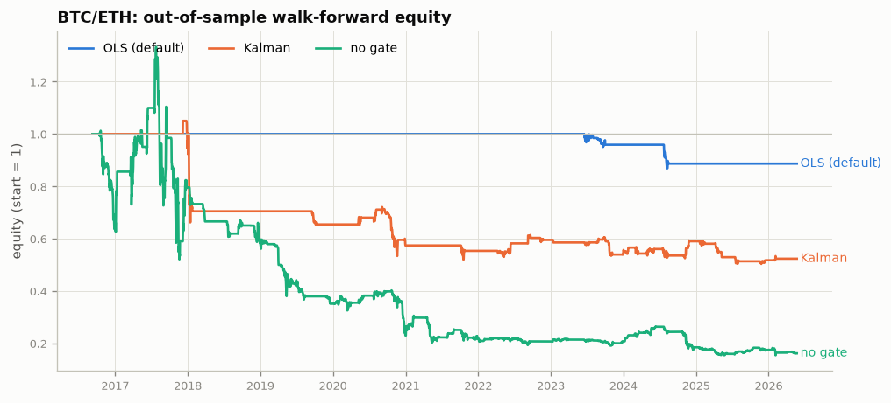


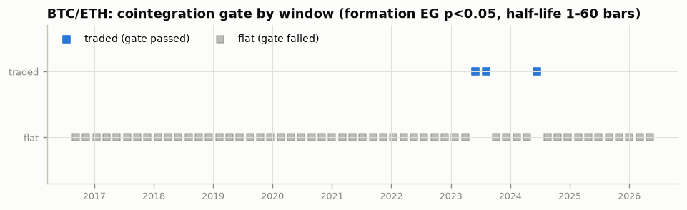


Threshold sensitivity (12 configurations). Deflated Sharpe probability of the default cell, accounting for this grid search: **0.02**.


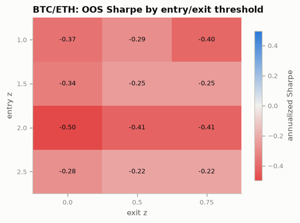


### LTC/ETH

Full-sample descriptives: EG p=0.380, β=0.51, half-life=264.5 bars, Hurst=0.47, n=3796. Walk-forward gate open 7% of 57 windows.


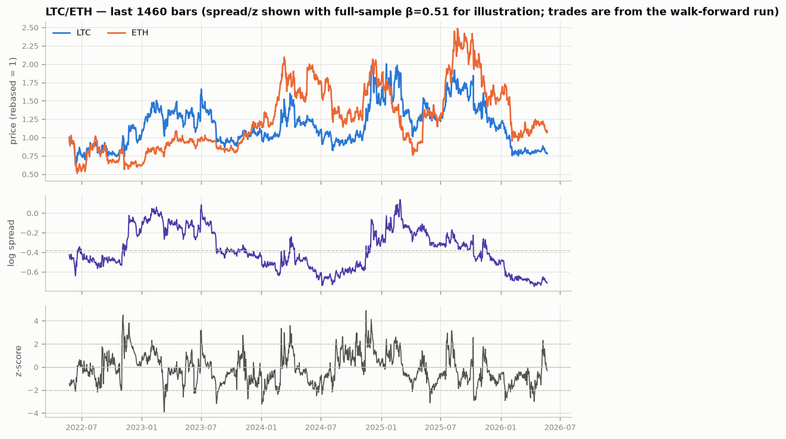


Method variants (all out-of-sample, base costs 12 bp/side):

|                              |   sharpe |   cagr_pct |   max_dd_pct |   n_trades |   win_rate_pct |   avg_trade_bp |   nw_tstat |   gate_pass_pct |   exposure_pct |
|:-----------------------------|---------:|-----------:|-------------:|-----------:|---------------:|---------------:|-----------:|----------------:|---------------:|
| OLS + rolling z (default)    |    -0.39 |     -12.73 |        82.12 |       3.00 |           0.00 |       -3136.27 |      -1.36 |            7.02 |           1.89 |
| OLS + frozen z (GGR)         |     0.23 |       2.54 |        47.28 |       5.00 |          40.00 |         814.84 |       0.70 |            7.02 |           3.27 |
| Kalman hedge                 |     0.21 |       2.10 |        38.16 |      59.00 |          71.19 |          58.31 |       0.68 |           63.16 |          19.16 |
| same-close execution (lag 0) |    -0.30 |     -13.18 |        84.82 |       3.00 |           0.00 |       -3009.27 |      -1.15 |            7.02 |           1.95 |
| no gate                      |    -0.13 |     -11.43 |        85.81 |      66.00 |          53.03 |         -71.42 |      -0.43 |          100.00 |          42.16 |


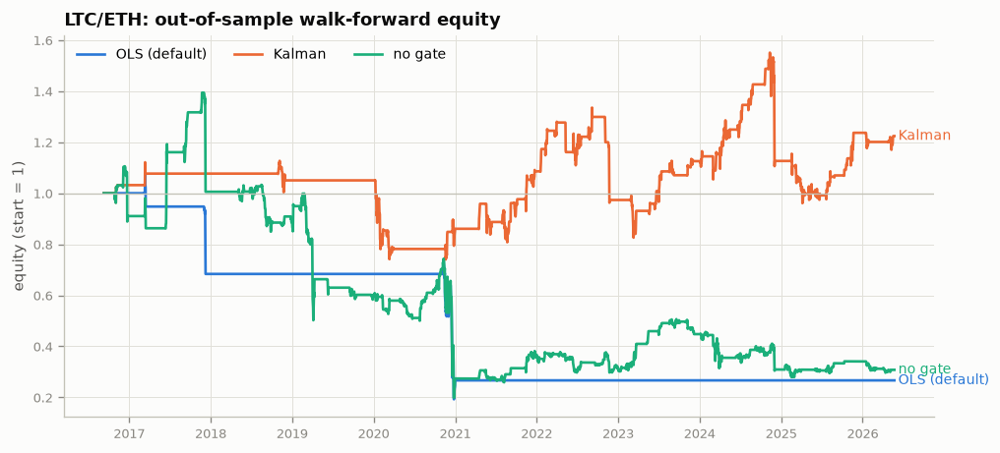


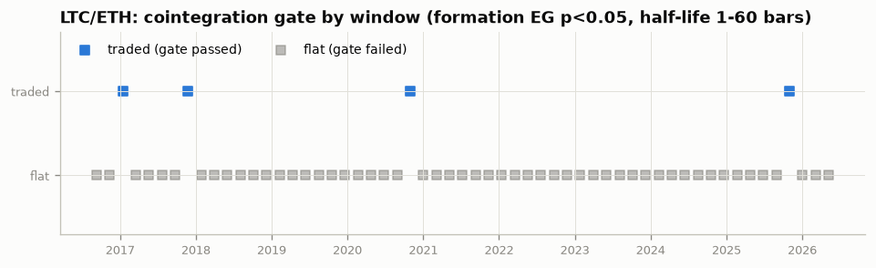


Threshold sensitivity (12 configurations). Deflated Sharpe probability of the default cell, accounting for this grid search: **0.04**.


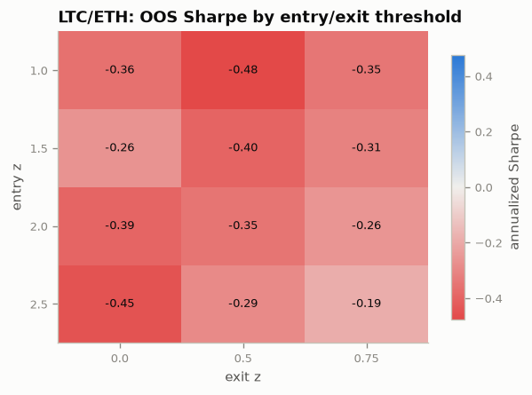


### Cost sensitivity


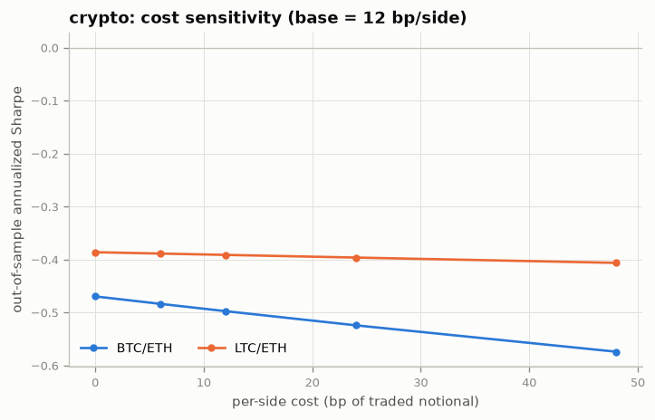


### Does the cointegration gate persist?

Fraction of formation windows passing the gate, and the probability of passing again next window given a pass now (Clegg 2014 asks whether the second number beats the first):

| pair    |   windows |   pass_rate |   p_pass_given_pass |
|:--------|----------:|------------:|--------------------:|
| BTC/ETH |     57.00 |        0.05 |                0.33 |
| LTC/ETH |     57.00 |        0.07 |                0.00 |


### Walk-forward top-3 portfolio

Pairs re-selected each window from formation data only (corr ≥ 0.6, EG p < 0.05, half-life gate), committed capital split into 3 fixed slots (unfilled slots stay in cash). Sharpe **-0.60**, CAGR -23.9%, max DD 94.8%, 152 trades, NW t-stat -1.98.


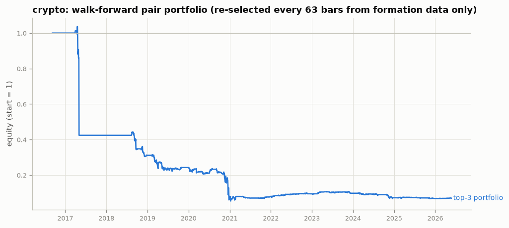


First selections:
- 2016-09-09: (none)
- 2016-11-11: (none)
- 2017-01-13: (none)
- 2017-03-17: LTC/BTC
- 2017-05-19: (none)
- 2017-07-21: (none)
- 2017-09-22: (none)
- 2017-11-24: (none)


<!-- generated by `pairs run --study stocks` -->

## Stocks

Featured pairs, default rule (enter 2σ / exit 0 / stop 4σ, 252d formation, 63d trading, next-close execution, 5 bp/side):

|            |   sharpe |   cagr_pct |   ann_vol_pct |   max_dd_pct |   n_trades |   win_rate_pct |   avg_trade_bp |   converged_pct |   nw_tstat |   gate_pass_pct |   years |
|:-----------|---------:|-----------:|--------------:|-------------:|-----------:|---------------:|---------------:|----------------:|-----------:|----------------:|--------:|
| KO/PEP     |     0.28 |       0.28 |          1.02 |         1.36 |       1.00 |         100.00 |         111.72 |          100.00 |       0.68 |           12.50 |    3.99 |
| XOM/CVX    |     0.43 |       0.66 |          1.57 |         1.39 |       1.00 |         100.00 |         265.79 |          100.00 |       0.89 |            6.25 |    3.99 |
| V/MA       |   nan    |       0.00 |          0.00 |         0.00 |       0.00 |         nan    |         nan    |          nan    |     nan    |            0.00 |    3.99 |
| JPM/BAC    |    -0.52 |      -1.25 |          2.37 |         5.31 |       3.00 |          33.33 |        -162.97 |           33.33 |      -1.22 |           12.50 |    3.99 |
| HD/LOW     |    -0.46 |      -0.69 |          1.46 |         2.97 |       1.00 |           0.00 |        -272.75 |            0.00 |      -0.99 |            6.25 |    3.99 |
| GOOGL/GOOG |     0.12 |       0.03 |          0.24 |         0.24 |       2.00 |          50.00 |           4.24 |           50.00 |       0.39 |            8.33 |    2.87 |


### Universe screen (stocks)

505 assets, 2013-02-08 → 2018-02-07; 1581 pairs pass the correlation prefilter (≥ 0.6); 154 of them reject the Engle-Granger null at 5%. With 127260 candidate pairs, ≈ 6363 would pass at 5% by pure chance (Clegg 2014), so this screen is *descriptive*: performance claims come only from the walk-forward section below.

|           |   corr |   eg_pvalue |   beta |   half_life |   hurst |    n_obs |
|:----------|-------:|------------:|-------:|------------:|--------:|---------:|
| LNC/MS    |  0.764 |       0.000 |  0.994 |      18.131 |   0.339 | 1259.000 |
| HBAN/SCHW |  0.716 |       0.000 |  0.704 |      16.527 |   0.326 | 1259.000 |
| DVN/APC   |  0.758 |       0.001 |  1.007 |      36.488 |   0.451 | 1259.000 |
| WEC/AWK   |  0.694 |       0.001 |  0.613 |      20.765 |   0.417 | 1259.000 |
| STT/C     |  0.736 |       0.001 |  0.937 |      23.598 |   0.334 | 1259.000 |
| USB/SCHW  |  0.710 |       0.001 |  0.495 |      21.713 |   0.337 | 1259.000 |
| UNM/CMA   |  0.737 |       0.002 |  0.762 |      22.518 |   0.314 | 1259.000 |
| UNM/RJF   |  0.718 |       0.002 |  0.845 |      30.039 |   0.402 | 1259.000 |
| UNM/MTB   |  0.694 |       0.002 |  1.228 |      25.068 |   0.391 | 1259.000 |
| DG/DLTR   |  0.621 |       0.002 |  0.744 |      20.085 |   0.403 | 1259.000 |

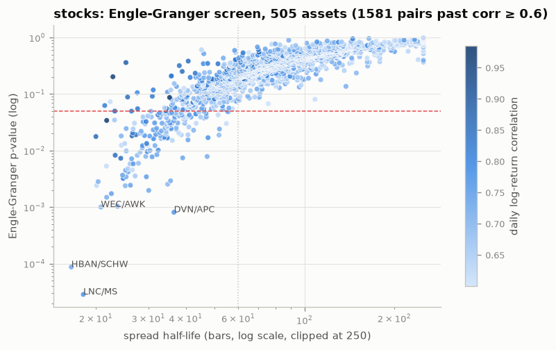


### KO/PEP

Full-sample descriptives: EG p=0.024, β=0.37, half-life=26.6 bars, Hurst=0.38, n=1259. Walk-forward gate open 12% of 16 windows.


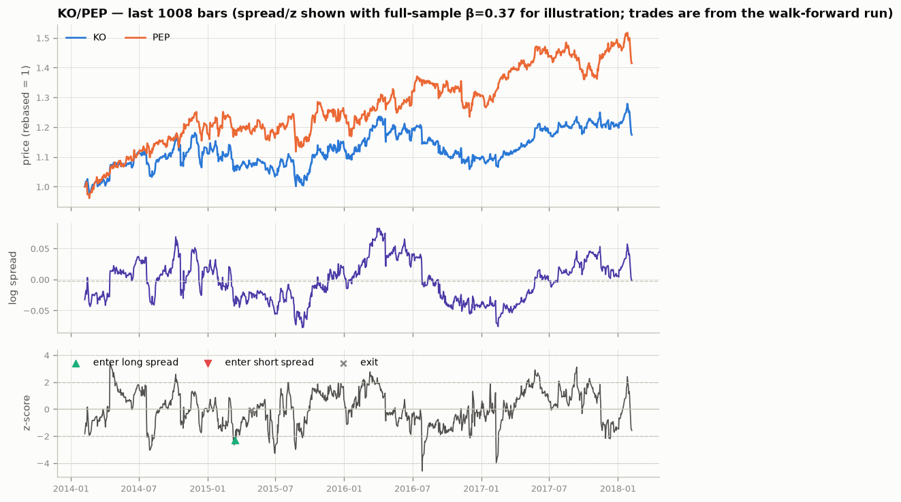


Method variants (all out-of-sample, base costs 5 bp/side):

|                              |   sharpe |   cagr_pct |   max_dd_pct |   n_trades |   win_rate_pct |   avg_trade_bp |   nw_tstat |   gate_pass_pct |   exposure_pct |
|:-----------------------------|---------:|-----------:|-------------:|-----------:|---------------:|---------------:|-----------:|----------------:|---------------:|
| OLS + rolling z (default)    |     0.28 |       0.28 |         1.36 |       1.00 |         100.00 |         111.72 |       0.68 |           12.50 |           2.88 |
| OLS + frozen z (GGR)         |     0.25 |       0.44 |         3.65 |       2.00 |          50.00 |          90.20 |       0.50 |           12.50 |           6.95 |
| Kalman hedge                 |     0.70 |       1.78 |         2.32 |      17.00 |          70.59 |          41.86 |       1.67 |           75.00 |          20.56 |
| same-close execution (lag 0) |     0.28 |       0.28 |         1.38 |       1.00 |         100.00 |         112.19 |       0.69 |           12.50 |           2.88 |
| no gate                      |     0.74 |       2.88 |         3.83 |      18.00 |          66.67 |          64.85 |       1.43 |          100.00 |          37.93 |


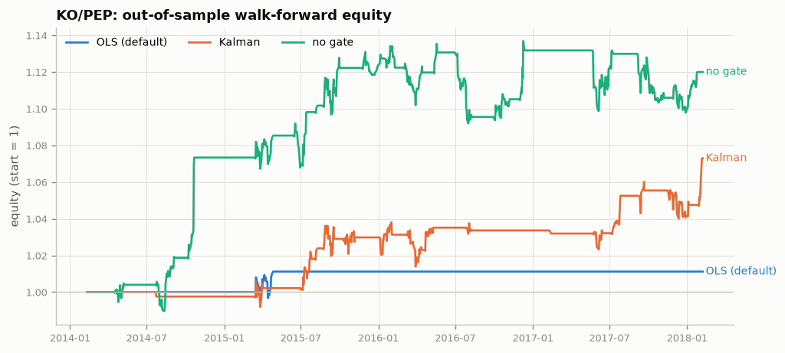


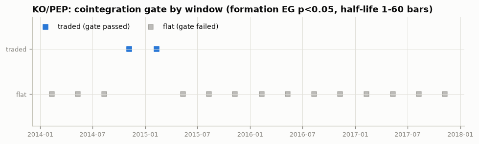


Threshold sensitivity (12 configurations). Deflated Sharpe probability of the default cell, accounting for this grid search: **0.45**.


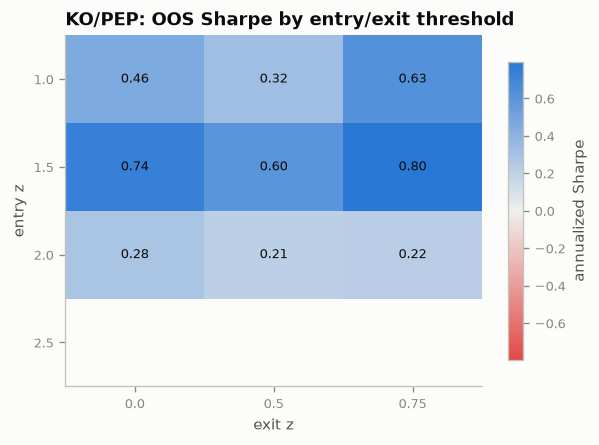


### XOM/CVX

Full-sample descriptives: EG p=0.835, β=0.47, half-life=110.0 bars, Hurst=0.41, n=1259. Walk-forward gate open 6% of 16 windows.


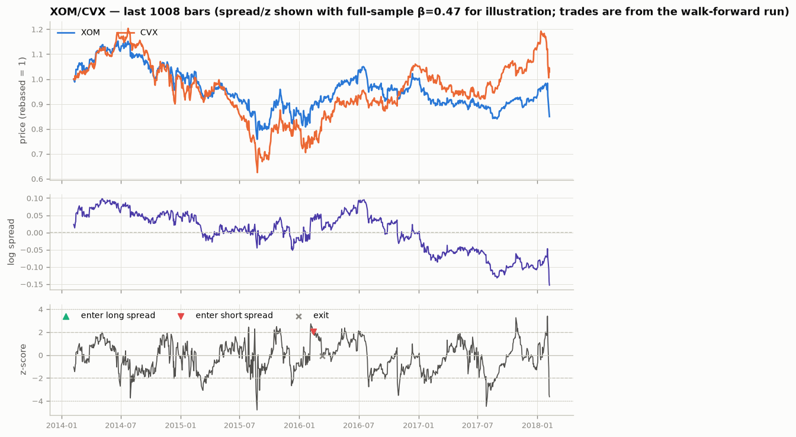


Method variants (all out-of-sample, base costs 5 bp/side):

|                              |   sharpe |   cagr_pct |   max_dd_pct |   n_trades |   win_rate_pct |   avg_trade_bp |   nw_tstat |   gate_pass_pct |   exposure_pct |
|:-----------------------------|---------:|-----------:|-------------:|-----------:|---------------:|---------------:|-----------:|----------------:|---------------:|
| OLS + rolling z (default)    |     0.43 |       0.66 |         1.39 |       1.00 |         100.00 |         265.79 |       0.89 |            6.25 |           1.89 |
| OLS + frozen z (GGR)         |    -0.12 |      -0.27 |         3.60 |       1.00 |           0.00 |        -105.86 |      -0.26 |            6.25 |           6.06 |
| Kalman hedge                 |     0.29 |       0.63 |         3.97 |       9.00 |          55.56 |          28.39 |       0.63 |           43.75 |          11.22 |
| same-close execution (lag 0) |     0.37 |       0.58 |         1.44 |       1.00 |         100.00 |         232.95 |       0.81 |            6.25 |           1.89 |
| no gate                      |     0.33 |       1.56 |         7.57 |      20.00 |          60.00 |          32.61 |       0.72 |          100.00 |          44.99 |


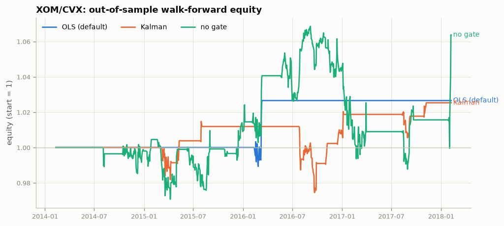


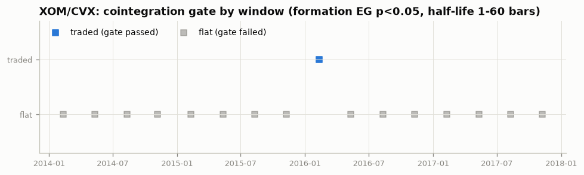


Threshold sensitivity (12 configurations). Deflated Sharpe probability of the default cell, accounting for this grid search: **0.81**.


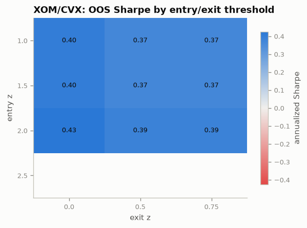


### V/MA

Full-sample descriptives: EG p=0.474, β=1.04, half-life=68.8 bars, Hurst=0.43, n=1259. Walk-forward gate open 0% of 16 windows.


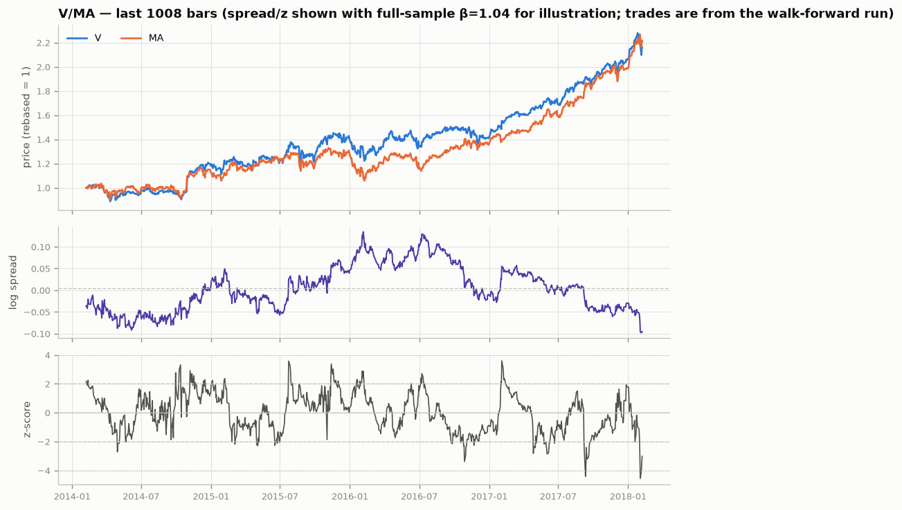


Method variants (all out-of-sample, base costs 5 bp/side):

|                              |   sharpe |   cagr_pct |   max_dd_pct |   n_trades |   win_rate_pct |   avg_trade_bp |   nw_tstat |   gate_pass_pct |   exposure_pct |
|:-----------------------------|---------:|-----------:|-------------:|-----------:|---------------:|---------------:|-----------:|----------------:|---------------:|
| OLS + rolling z (default)    |   nan    |       0.00 |         0.00 |       0.00 |         nan    |         nan    |     nan    |            0.00 |           0.00 |
| OLS + frozen z (GGR)         |   nan    |       0.00 |         0.00 |       0.00 |         nan    |         nan    |     nan    |            0.00 |           0.00 |
| Kalman hedge                 |    -0.41 |      -1.30 |         5.80 |      10.00 |          60.00 |         -50.91 |      -0.89 |           50.00 |          14.50 |
| same-close execution (lag 0) |   nan    |       0.00 |         0.00 |       0.00 |         nan    |         nan    |     nan    |            0.00 |           0.00 |
| no gate                      |     0.09 |       0.29 |         6.25 |      25.00 |          60.00 |           5.18 |       0.22 |          100.00 |          56.01 |


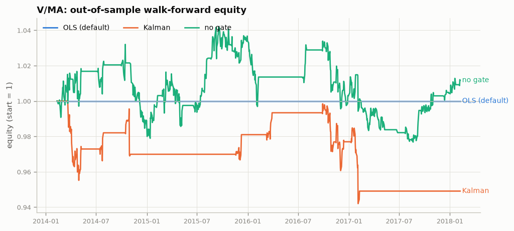


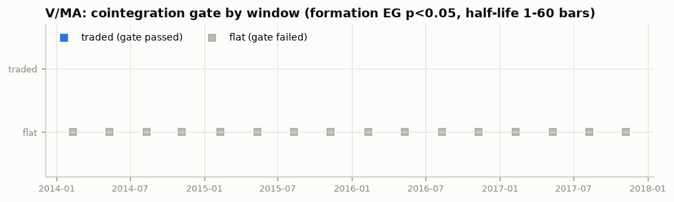


Threshold sensitivity (12 configurations). Deflated Sharpe probability of the default cell, accounting for this grid search: **nan**.


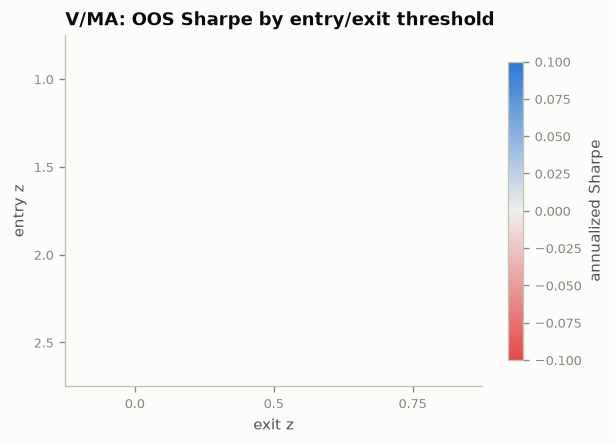


### JPM/BAC

Full-sample descriptives: EG p=0.457, β=0.86, half-life=105.4 bars, Hurst=0.44, n=1259. Walk-forward gate open 12% of 16 windows.


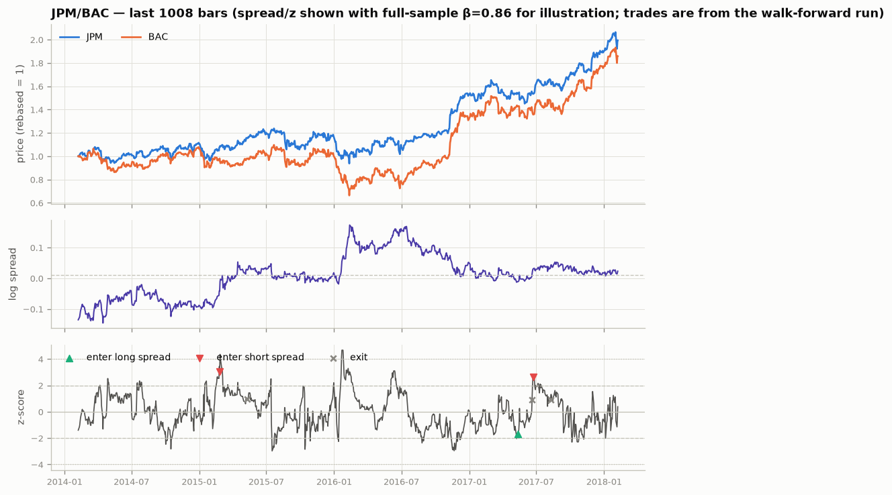


Method variants (all out-of-sample, base costs 5 bp/side):

|                              |   sharpe |   cagr_pct |   max_dd_pct |   n_trades |   win_rate_pct |   avg_trade_bp |   nw_tstat |   gate_pass_pct |   exposure_pct |
|:-----------------------------|---------:|-----------:|-------------:|-----------:|---------------:|---------------:|-----------:|----------------:|---------------:|
| OLS + rolling z (default)    |    -0.52 |      -1.25 |         5.31 |       3.00 |          33.33 |        -162.97 |      -1.22 |           12.50 |          10.92 |
| OLS + frozen z (GGR)         |    -0.25 |      -0.51 |         5.15 |       3.00 |          33.33 |         -65.35 |      -0.51 |           12.50 |           7.15 |
| Kalman hedge                 |    -0.13 |      -0.45 |         5.55 |      10.00 |          70.00 |         -17.09 |      -0.29 |           50.00 |          16.29 |
| same-close execution (lag 0) |    -0.57 |      -1.37 |         5.40 |       3.00 |          33.33 |        -180.74 |      -1.34 |           12.50 |          11.12 |
| no gate                      |     0.48 |       2.06 |         5.43 |      23.00 |          82.61 |          36.68 |       0.98 |          100.00 |          34.06 |


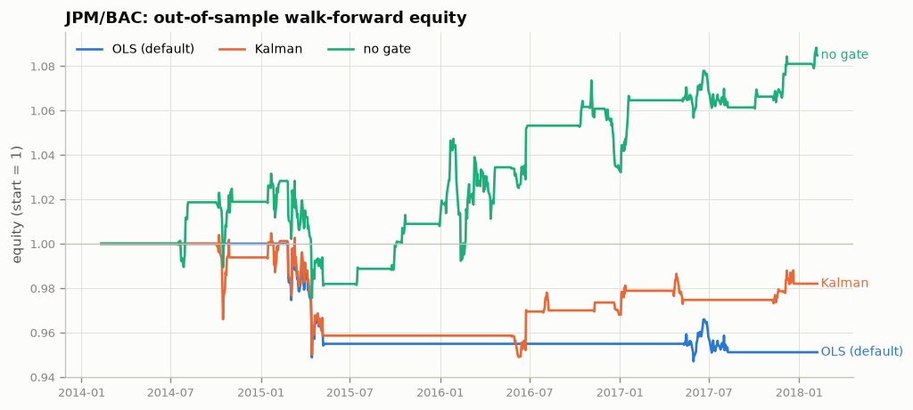


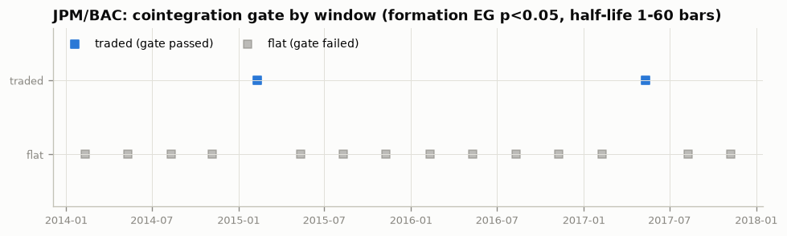


Threshold sensitivity (12 configurations). Deflated Sharpe probability of the default cell, accounting for this grid search: **0.09**.


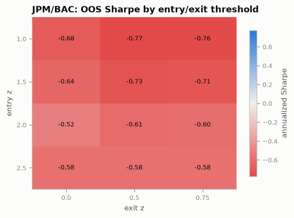


### HD/LOW

Full-sample descriptives: EG p=0.623, β=1.08, half-life=86.9 bars, Hurst=0.47, n=1259. Walk-forward gate open 6% of 16 windows.


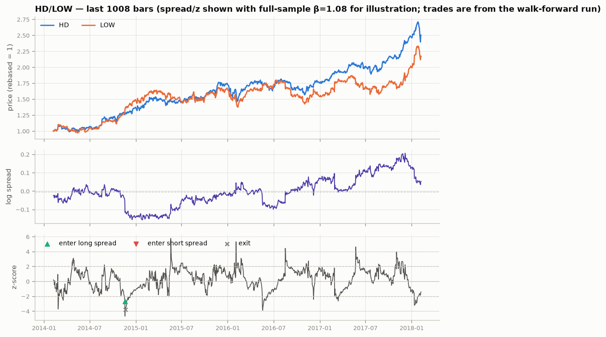


Method variants (all out-of-sample, base costs 5 bp/side):

|                              |   sharpe |   cagr_pct |   max_dd_pct |   n_trades |   win_rate_pct |   avg_trade_bp |   nw_tstat |   gate_pass_pct |   exposure_pct |
|:-----------------------------|---------:|-----------:|-------------:|-----------:|---------------:|---------------:|-----------:|----------------:|---------------:|
| OLS + rolling z (default)    |    -0.46 |      -0.69 |         2.97 |       1.00 |           0.00 |        -272.75 |      -0.99 |            6.25 |           0.20 |
| OLS + frozen z (GGR)         |    -0.47 |      -0.29 |         1.16 |       1.00 |           0.00 |        -116.25 |      -1.26 |            6.25 |           0.89 |
| Kalman hedge                 |     0.01 |      -0.06 |         7.68 |      14.00 |          50.00 |          -0.48 |       0.02 |           62.50 |          21.45 |
| same-close execution (lag 0) |    -0.61 |      -0.94 |         3.70 |       1.00 |           0.00 |        -370.48 |      -1.03 |            6.25 |           0.20 |
| no gate                      |    -0.25 |      -1.47 |        11.78 |      21.00 |          57.14 |         -27.24 |      -0.63 |          100.00 |          54.72 |


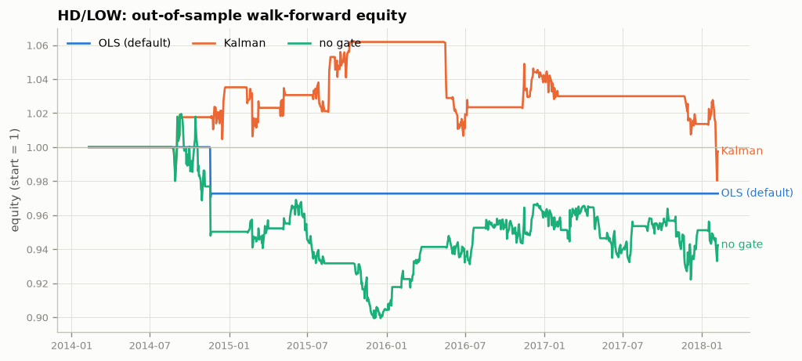


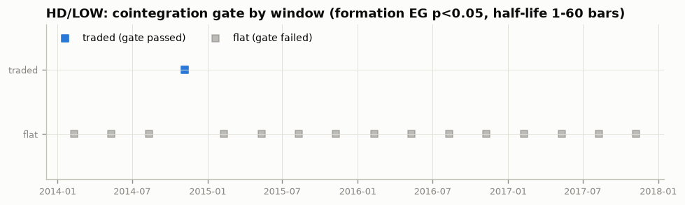


Threshold sensitivity (12 configurations). Deflated Sharpe probability of the default cell, accounting for this grid search: **0.00**.


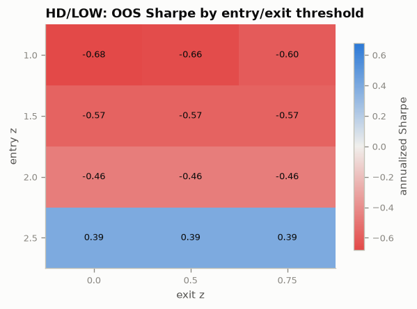


### GOOGL/GOOG

Full-sample descriptives: EG p=0.600, β=1.00, half-life=32.5 bars, Hurst=0.43, n=975. Walk-forward gate open 8% of 12 windows.


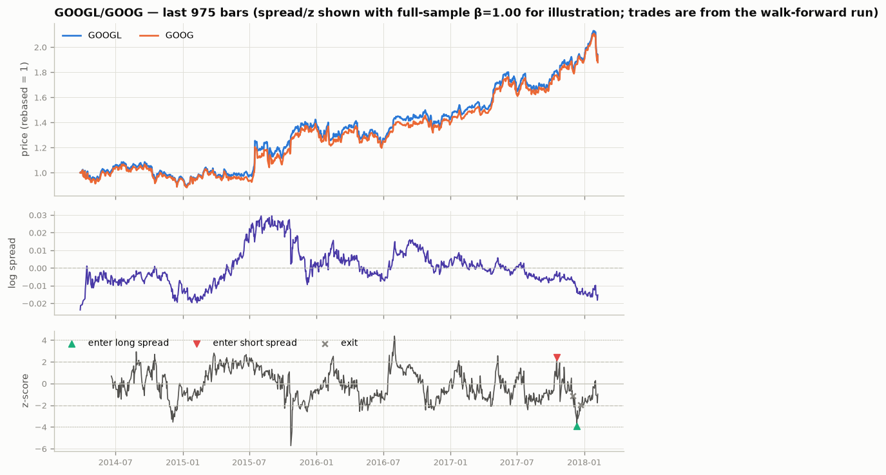


Method variants (all out-of-sample, base costs 5 bp/side):

|                              |   sharpe |   cagr_pct |   max_dd_pct |   n_trades |   win_rate_pct |   avg_trade_bp |   nw_tstat |   gate_pass_pct |   exposure_pct |
|:-----------------------------|---------:|-----------:|-------------:|-----------:|---------------:|---------------:|-----------:|----------------:|---------------:|
| OLS + rolling z (default)    |     0.12 |       0.03 |         0.24 |       2.00 |          50.00 |           4.24 |       0.39 |            8.33 |           5.39 |
| OLS + frozen z (GGR)         |    -0.69 |      -0.06 |         0.20 |       1.00 |           0.00 |         -17.79 |      -1.15 |            8.33 |           0.97 |
| Kalman hedge                 |    -0.40 |      -0.28 |         1.53 |       8.00 |          50.00 |         -10.02 |      -0.76 |           50.00 |          13.97 |
| same-close execution (lag 0) |    -0.14 |      -0.04 |         0.27 |       2.00 |          50.00 |          -5.07 |      -0.40 |            8.33 |           5.53 |
| no gate                      |    -0.99 |      -1.38 |         4.60 |      14.00 |          35.71 |         -28.33 |      -2.03 |          100.00 |          62.66 |


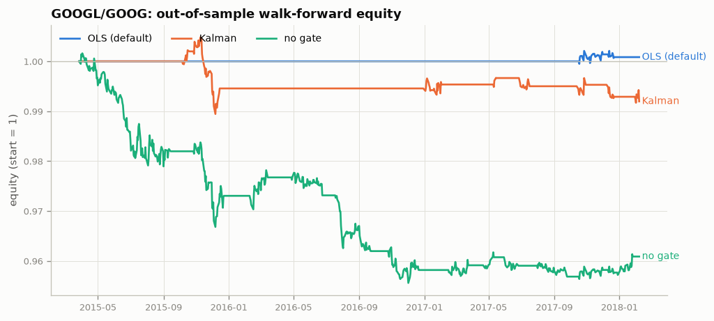


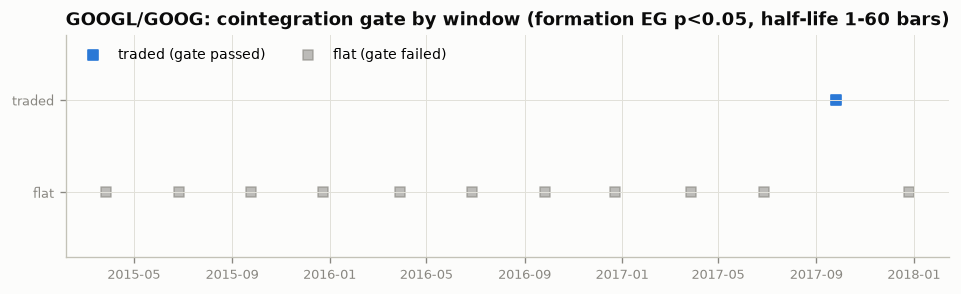


Threshold sensitivity (12 configurations). Deflated Sharpe probability of the default cell, accounting for this grid search: **0.28**.


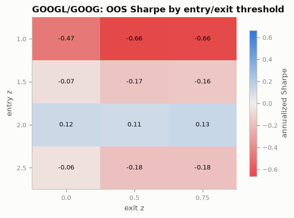


### Cost sensitivity


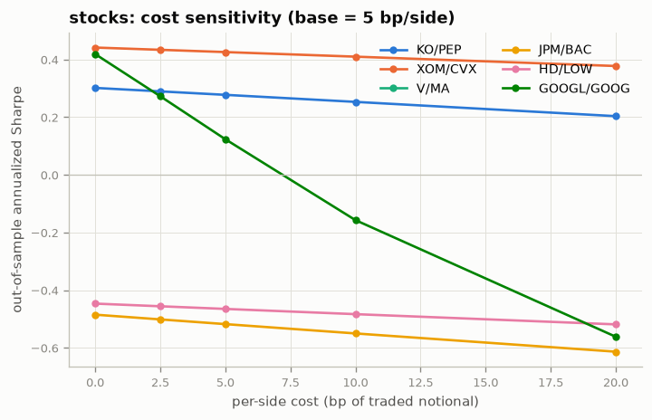


### Does the cointegration gate persist?

Fraction of formation windows passing the gate, and the probability of passing again next window given a pass now (Clegg 2014 asks whether the second number beats the first):

| pair       |   windows |   pass_rate |   p_pass_given_pass |
|:-----------|----------:|------------:|--------------------:|
| KO/PEP     |     16.00 |        0.12 |                0.50 |
| XOM/CVX    |     16.00 |        0.06 |                0.00 |
| V/MA       |     16.00 |        0.00 |              nan    |
| JPM/BAC    |     16.00 |        0.12 |                0.00 |
| HD/LOW     |     16.00 |        0.06 |                0.00 |
| GOOGL/GOOG |     12.00 |        0.08 |                0.00 |


### Walk-forward top-10 portfolio

Pairs re-selected each window from formation data only (corr ≥ 0.9, EG p < 0.05, half-life gate), committed capital split into 10 fixed slots (unfilled slots stay in cash). Sharpe **0.02**, CAGR 0.0%, max DD 1.0%, 51 trades, NW t-stat 0.04.


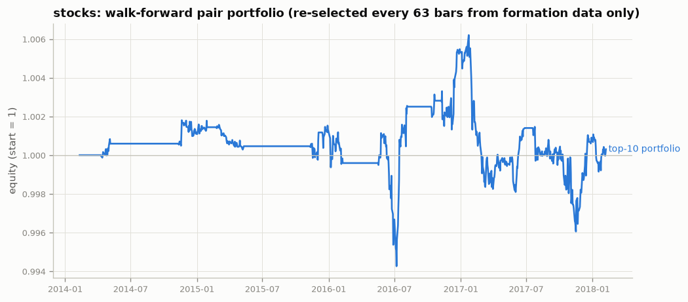


First selections:
- 2014-02-10: DISCA/DISCK
- 2014-05-12: (none)
- 2014-08-11: (none)
- 2014-11-07: FOX/FOXA, NWS/NWSA
- 2015-02-10: NWSA/NWS
- 2015-05-12: (none)
- 2015-08-11: (none)
- 2015-11-09: DTE/XEL


### Long-history check: JPM/BAC 1995-2018

Sharpe 0.18, CAGR 0.6%, 11 trades over 22 years; gate open 11% of windows.


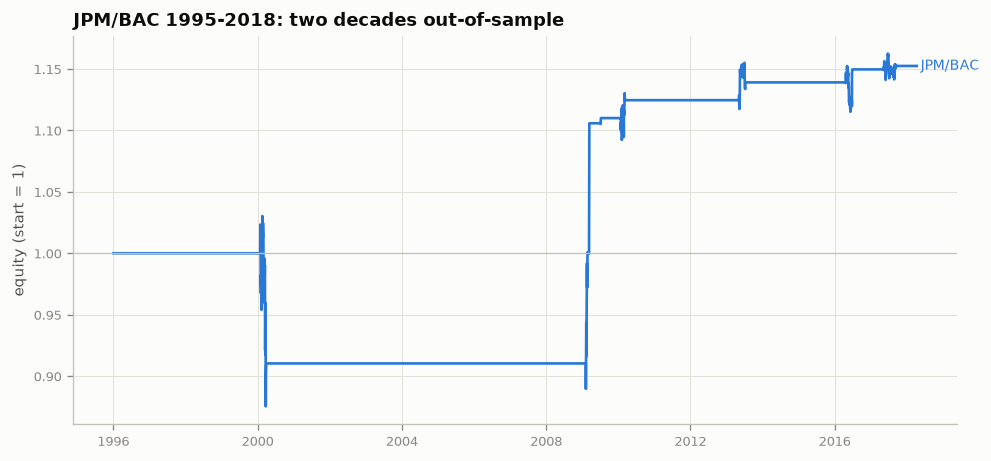


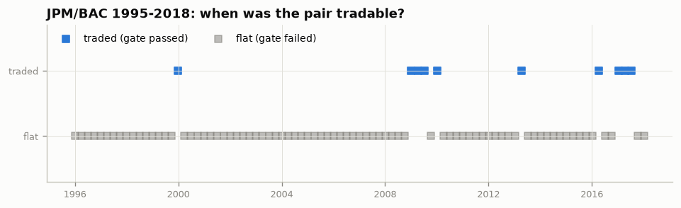


<!-- generated by `pairs run --study forex` -->

## Forex

Featured pairs, default rule (enter 2σ / exit 0 / stop 4σ, 252d formation, 63d trading, next-close execution, 2 bp/side):

|         |   sharpe |   cagr_pct |   ann_vol_pct |   max_dd_pct |   n_trades |   win_rate_pct |   avg_trade_bp |   converged_pct |   nw_tstat |   gate_pass_pct |   years |
|:--------|---------:|-----------:|--------------:|-------------:|-----------:|---------------:|---------------:|----------------:|-----------:|----------------:|--------:|
| AUD/NZD |    -0.17 |      -0.07 |          0.41 |         2.10 |       7.00 |          28.57 |         -26.11 |           28.57 |      -0.90 |            4.72 |   26.50 |
| EUR/GBP |     0.13 |       0.07 |          0.54 |         2.24 |      11.00 |          63.64 |          17.11 |           54.55 |       0.71 |            8.49 |   26.50 |
| SEK/NOK |    -0.13 |      -0.13 |          0.96 |         7.18 |       5.00 |          20.00 |         -69.22 |           60.00 |      -0.72 |            3.77 |   26.50 |


### Universe screen (forex)

11 assets, 1999-01-04 → 2026-08-21; 38 pairs pass the correlation prefilter (≥ 0.5); 3 of them reject the Engle-Granger null at 5%. With 55 candidate pairs, ≈ 3 would pass at 5% by pure chance (Clegg 2014), so this screen is *descriptive*: performance claims come only from the walk-forward section below.

|         |   corr |   eg_pvalue |   beta |   half_life |   hurst |    n_obs |
|:--------|-------:|------------:|-------:|------------:|--------:|---------:|
| AUD/CAD |  0.646 |       0.034 |  1.225 |     135.586 |   0.445 | 6931.000 |
| EUR/DKK |  0.981 |       0.036 |  1.001 |       2.851 |   0.097 | 6931.000 |
| SEK/NOK |  0.801 |       0.036 |  0.735 |     191.369 |   0.478 | 6931.000 |
| CAD/SEK |  0.518 |       0.050 |  0.694 |     253.296 |   0.433 | 6931.000 |
| EUR/AUD |  0.552 |       0.083 |  0.627 |     222.147 |   0.457 | 6931.000 |
| NZD/EUR |  0.549 |       0.098 |  1.102 |     284.958 |   0.452 | 6931.000 |
| DKK/AUD |  0.539 |       0.102 |  0.627 |     211.284 |   0.454 | 6931.000 |
| NZD/DKK |  0.539 |       0.179 |  1.103 |     277.059 |   0.451 | 6931.000 |
| NZD/AUD |  0.830 |       0.233 |  0.914 |     348.274 |   0.484 | 6931.000 |
| AUD/SEK |  0.607 |       0.251 |  0.895 |     313.836 |   0.425 | 6931.000 |

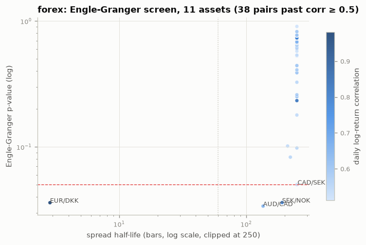


### AUD/NZD

Full-sample descriptives: EG p=0.288, β=0.92, half-life=361.0 bars, Hurst=0.49, n=6931. Walk-forward gate open 5% of 106 windows.


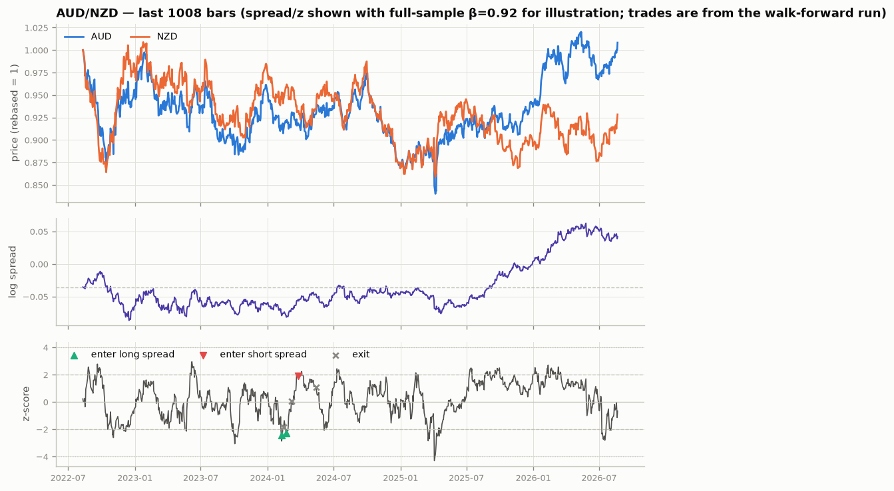


Method variants (all out-of-sample, base costs 2 bp/side):

|                              |   sharpe |   cagr_pct |   max_dd_pct |   n_trades |   win_rate_pct |   avg_trade_bp |   nw_tstat |   gate_pass_pct |   exposure_pct |
|:-----------------------------|---------:|-----------:|-------------:|-----------:|---------------:|---------------:|-----------:|----------------:|---------------:|
| OLS + rolling z (default)    |    -0.17 |      -0.07 |         2.10 |       7.00 |          28.57 |         -26.11 |      -0.90 |            4.72 |           1.92 |
| OLS + frozen z (GGR)         |     0.09 |       0.04 |         1.59 |       4.00 |          75.00 |          24.12 |       0.47 |            4.72 |           1.48 |
| Kalman hedge                 |    -0.07 |      -0.09 |         6.79 |       7.00 |          57.14 |         -30.98 |      -0.42 |            4.72 |           2.46 |
| same-close execution (lag 0) |    -0.21 |      -0.09 |         2.51 |       7.00 |          28.57 |         -33.36 |      -1.17 |            4.72 |           1.98 |
| no gate                      |    -0.31 |      -0.96 |        25.44 |     115.00 |          53.04 |         -21.33 |      -1.78 |          100.00 |          42.72 |


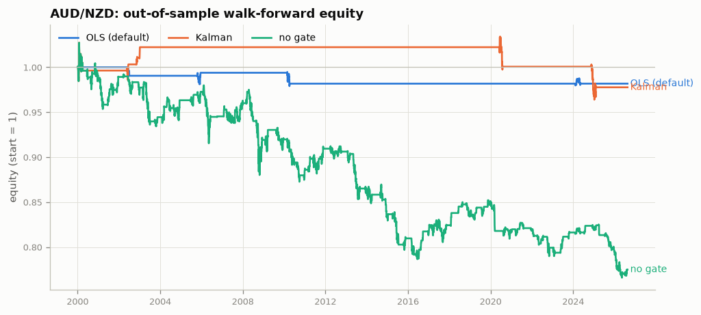


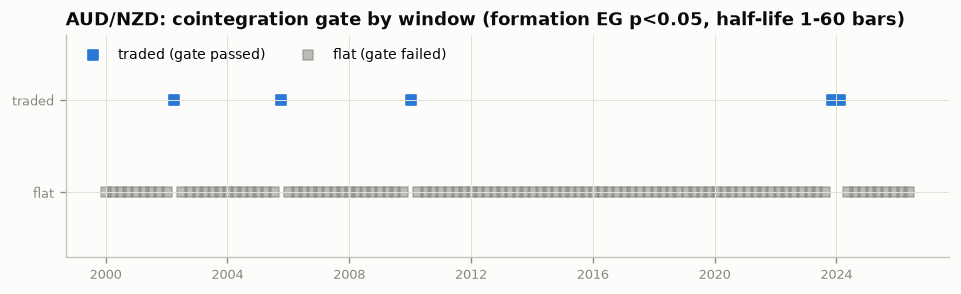


Threshold sensitivity (12 configurations). Deflated Sharpe probability of the default cell, accounting for this grid search: **0.09**.


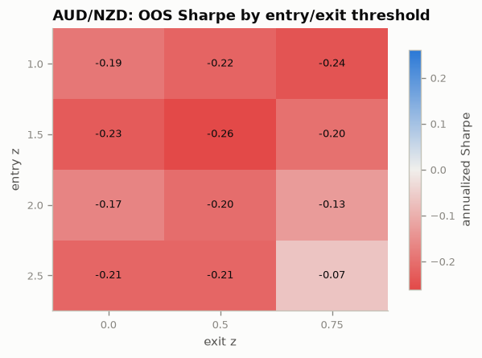


### EUR/GBP

Full-sample descriptives: EG p=0.680, β=0.51, half-life=823.0 bars, Hurst=0.49, n=6931. Walk-forward gate open 8% of 106 windows.


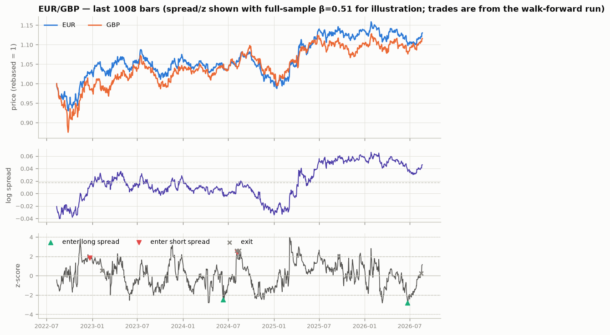


Method variants (all out-of-sample, base costs 2 bp/side):

|                              |   sharpe |   cagr_pct |   max_dd_pct |   n_trades |   win_rate_pct |   avg_trade_bp |   nw_tstat |   gate_pass_pct |   exposure_pct |
|:-----------------------------|---------:|-----------:|-------------:|-----------:|---------------:|---------------:|-----------:|----------------:|---------------:|
| OLS + rolling z (default)    |     0.13 |       0.07 |         2.24 |      11.00 |          63.64 |          17.11 |       0.71 |            8.49 |           4.12 |
| OLS + frozen z (GGR)         |    -0.01 |      -0.01 |         3.42 |       9.00 |          55.56 |          -2.05 |      -0.06 |            8.49 |           4.00 |
| Kalman hedge                 |     0.05 |       0.04 |         5.32 |      17.00 |          64.71 |           6.88 |       0.27 |           15.09 |           5.45 |
| same-close execution (lag 0) |     0.09 |       0.05 |         2.58 |      11.00 |          45.45 |          11.30 |       0.49 |            8.49 |           4.19 |
| no gate                      |     0.03 |       0.04 |        17.54 |     124.00 |          59.68 |           1.55 |       0.14 |          100.00 |          41.99 |


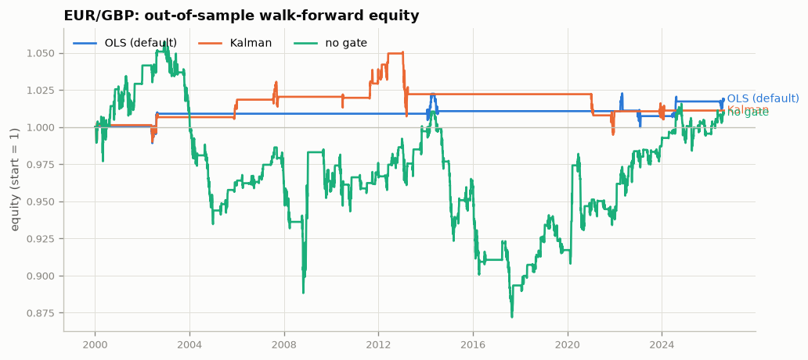


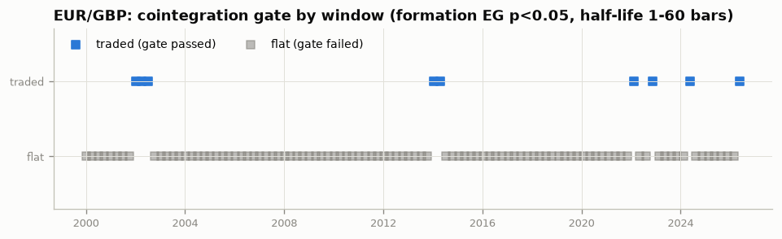


Threshold sensitivity (12 configurations). Deflated Sharpe probability of the default cell, accounting for this grid search: **0.56**.


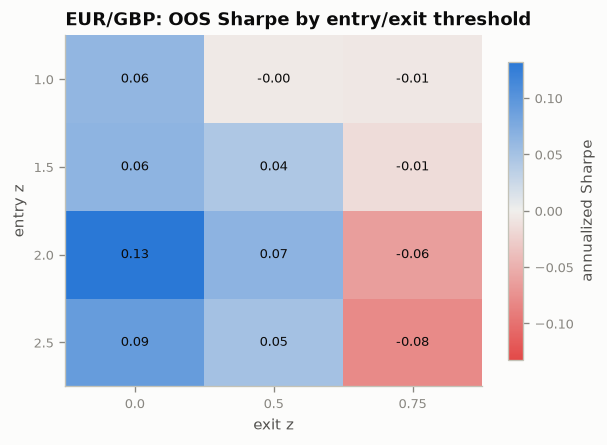


### SEK/NOK

Full-sample descriptives: EG p=0.036, β=0.73, half-life=191.4 bars, Hurst=0.48, n=6931. Walk-forward gate open 4% of 106 windows.


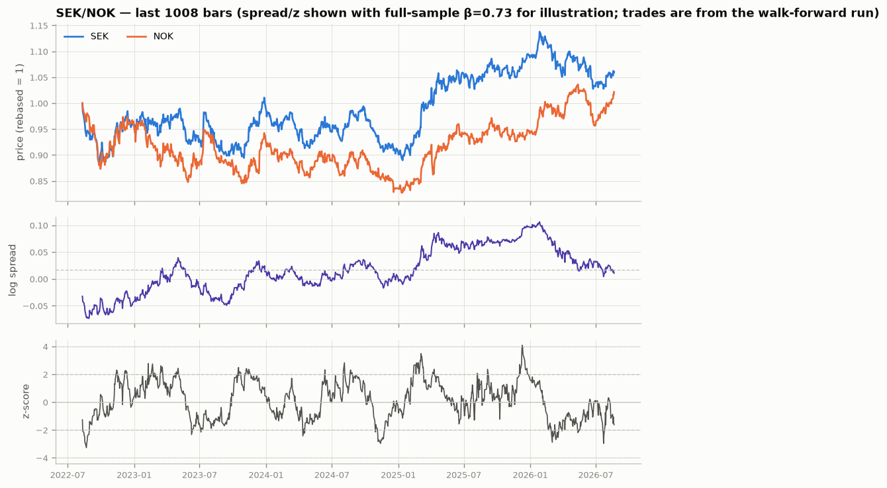


Method variants (all out-of-sample, base costs 2 bp/side):

|                              |   sharpe |   cagr_pct |   max_dd_pct |   n_trades |   win_rate_pct |   avg_trade_bp |   nw_tstat |   gate_pass_pct |   exposure_pct |
|:-----------------------------|---------:|-----------:|-------------:|-----------:|---------------:|---------------:|-----------:|----------------:|---------------:|
| OLS + rolling z (default)    |    -0.13 |      -0.13 |         7.18 |       5.00 |          20.00 |         -69.22 |      -0.72 |            3.77 |           2.11 |
| OLS + frozen z (GGR)         |    -0.15 |      -0.08 |         3.64 |       8.00 |          37.50 |         -26.54 |      -0.98 |            3.77 |           1.18 |
| Kalman hedge                 |    -0.06 |      -0.07 |         5.76 |      25.00 |          52.00 |          -6.78 |      -0.32 |           17.92 |           7.14 |
| same-close execution (lag 0) |    -0.05 |      -0.05 |         5.46 |       5.00 |          60.00 |         -27.35 |      -0.26 |            3.77 |           2.14 |
| no gate                      |    -0.20 |      -0.64 |        17.86 |     127.00 |          51.97 |         -12.80 |      -1.11 |          100.00 |          49.15 |


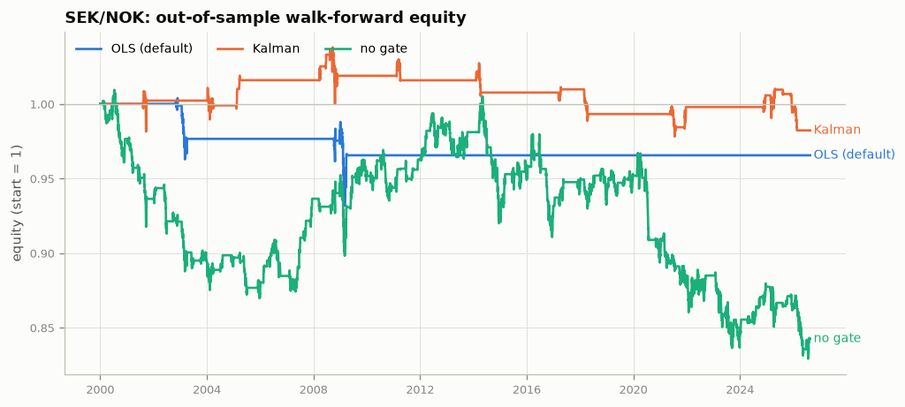


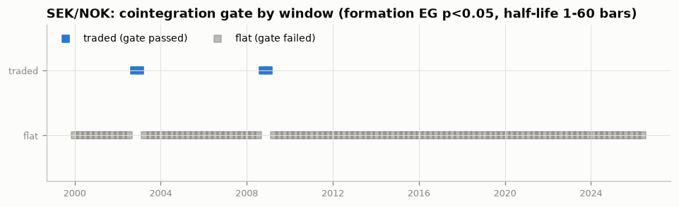


Threshold sensitivity (12 configurations). Deflated Sharpe probability of the default cell, accounting for this grid search: **0.13**.


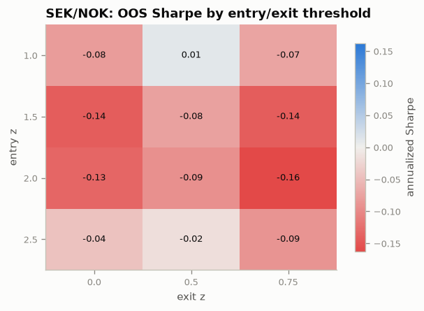


### Cost sensitivity


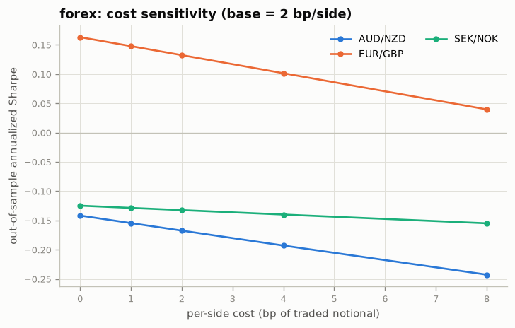


### Does the cointegration gate persist?

Fraction of formation windows passing the gate, and the probability of passing again next window given a pass now (Clegg 2014 asks whether the second number beats the first):

| pair    |   windows |   pass_rate |   p_pass_given_pass |
|:--------|----------:|------------:|--------------------:|
| AUD/NZD |    106.00 |        0.05 |                0.20 |
| EUR/GBP |    106.00 |        0.08 |                0.38 |
| SEK/NOK |    106.00 |        0.04 |                0.50 |


<!-- generated by `pairs run --study commodities` -->

## Commodities

Featured pairs, default rule (enter 2σ / exit 0 / stop 4σ, 252d formation, 63d trading, next-close execution, 5 bp/side):

|            |   sharpe |   cagr_pct |   ann_vol_pct |   max_dd_pct |   n_trades |   win_rate_pct |   avg_trade_bp |   converged_pct |   nw_tstat |   gate_pass_pct |   years |
|:-----------|---------:|-----------:|--------------:|-------------:|-----------:|---------------:|---------------:|----------------:|-----------:|----------------:|--------:|
| WTI/BRENT  |     0.39 |       2.07 |          5.65 |         8.58 |      79.00 |          67.09 |          94.23 |           72.15 |       3.26 |           30.50 |   35.18 |
| NATGAS/WTI |     0.49 |       5.18 |         11.63 |        25.26 |      21.00 |          80.95 |         760.76 |           76.19 |       2.50 |           14.91 |   28.41 |


### Universe screen (commodities)

3 assets, 1990-01-02 → 2026-08-25; 1 pairs pass the correlation prefilter (≥ 0.3); 1 of them reject the Engle-Granger null at 5%. With 3 candidate pairs, ≈ 0 would pass at 5% by pure chance (Clegg 2014), so this screen is *descriptive*: performance claims come only from the walk-forward section below.

|           |   corr |   eg_pvalue |   beta |   half_life |   hurst |    n_obs |
|:----------|-------:|------------:|-------:|------------:|--------:|---------:|
| WTI/BRENT |  0.638 |       0.000 |  0.906 |       8.878 |   0.208 | 9119.000 |

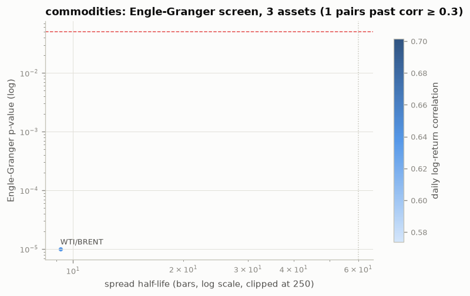


### WTI/BRENT

Full-sample descriptives: EG p=0.000, β=0.91, half-life=8.9 bars, Hurst=0.21, n=9119. Walk-forward gate open 30% of 141 windows.


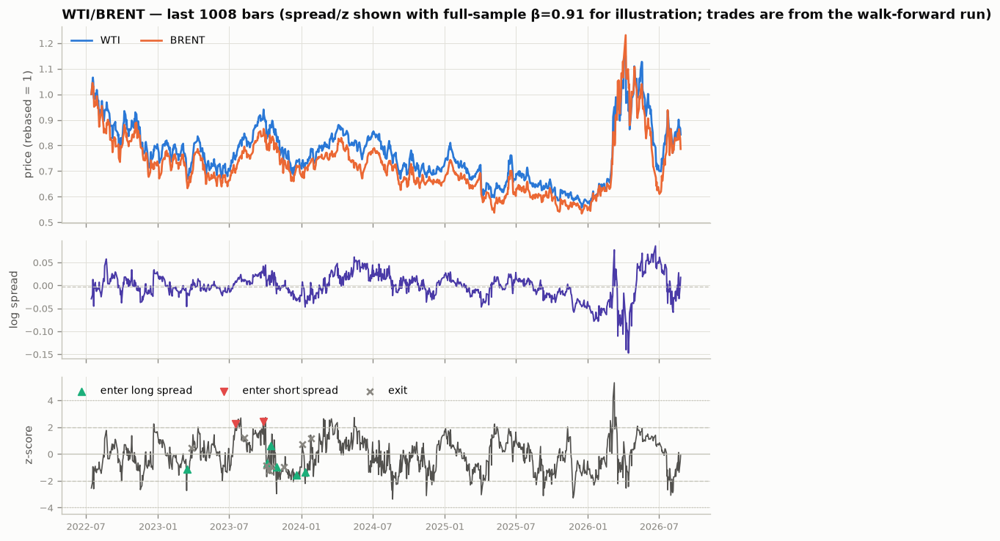


Method variants (all out-of-sample, base costs 5 bp/side):

|                              |   sharpe |   cagr_pct |   max_dd_pct |   n_trades |   win_rate_pct |   avg_trade_bp |   nw_tstat |   gate_pass_pct |   exposure_pct |
|:-----------------------------|---------:|-----------:|-------------:|-----------:|---------------:|---------------:|-----------:|----------------:|---------------:|
| OLS + rolling z (default)    |     0.39 |       2.07 |         8.58 |      79.00 |          67.09 |          94.23 |       3.26 |           30.50 |           9.24 |
| OLS + frozen z (GGR)         |     0.27 |       1.30 |        11.28 |      57.00 |          61.40 |          82.33 |       2.41 |           30.50 |           6.79 |
| Kalman hedge                 |     0.29 |       2.11 |        27.57 |     181.00 |          59.67 |          44.85 |       2.11 |           63.83 |          18.13 |
| same-close execution (lag 0) |     0.81 |       4.84 |         7.45 |      80.00 |          88.75 |         213.97 |       5.38 |           30.50 |           9.43 |
| no gate                      |     0.42 |       3.66 |        29.57 |     252.00 |          61.90 |          52.94 |       3.57 |          100.00 |          33.62 |


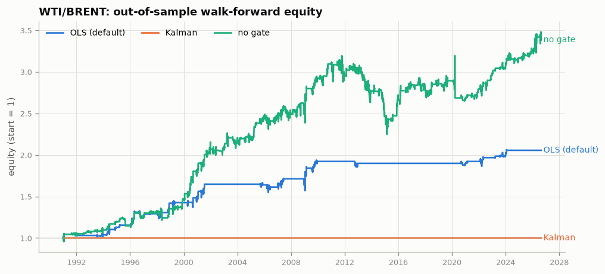


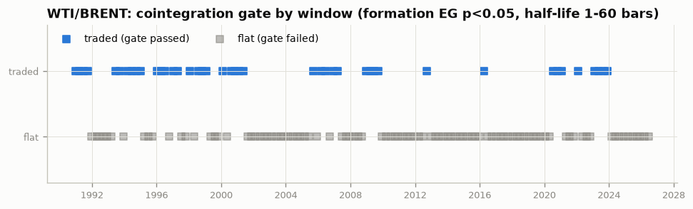


Threshold sensitivity (12 configurations). Deflated Sharpe probability of the default cell, accounting for this grid search: **0.97**.


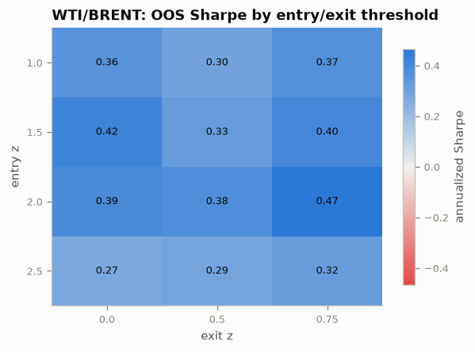


### NATGAS/WTI

Full-sample descriptives: EG p=0.053, β=0.30, half-life=61.7 bars, Hurst=0.32, n=7413. Walk-forward gate open 15% of 114 windows.


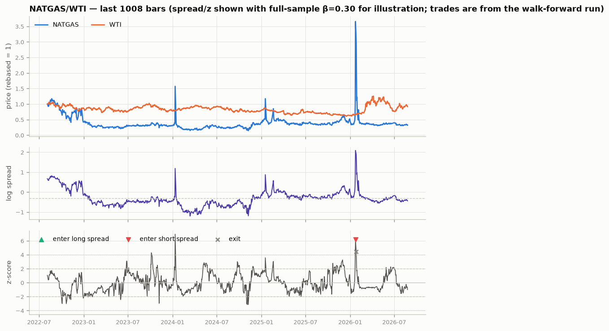


Method variants (all out-of-sample, base costs 5 bp/side):

|                              |   sharpe |   cagr_pct |   max_dd_pct |   n_trades |   win_rate_pct |   avg_trade_bp |   nw_tstat |   gate_pass_pct |   exposure_pct |
|:-----------------------------|---------:|-----------:|-------------:|-----------:|---------------:|---------------:|-----------:|----------------:|---------------:|
| OLS + rolling z (default)    |     0.49 |       5.18 |        25.26 |      21.00 |          80.95 |         760.76 |       2.50 |           14.91 |           4.94 |
| OLS + frozen z (GGR)         |     0.10 |     nan    |       100.00 |      12.00 |          75.00 |         -98.31 |       0.47 |           14.91 |           3.37 |
| Kalman hedge                 |     0.31 |       4.57 |        59.21 |      83.00 |          66.27 |         205.12 |       1.77 |           50.00 |          17.12 |
| same-close execution (lag 0) |     0.26 |       2.62 |        56.03 |      21.00 |          71.43 |         576.17 |       1.43 |           14.91 |           5.00 |
| no gate                      |     0.23 |     nan    |       100.00 |     105.00 |          57.14 |          69.70 |       1.42 |          100.00 |          31.13 |


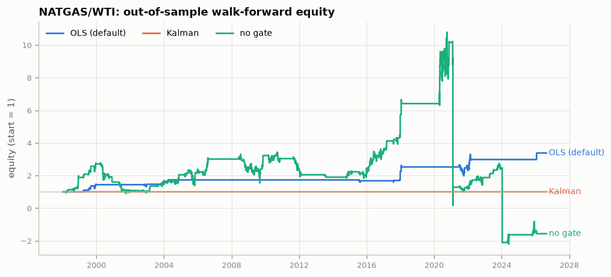


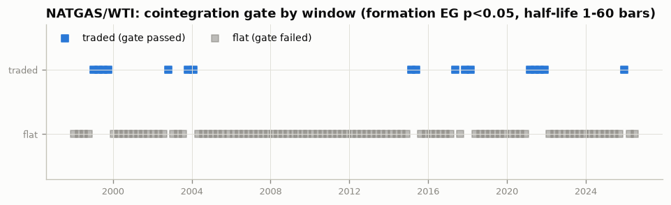


Threshold sensitivity (12 configurations). Deflated Sharpe probability of the default cell, accounting for this grid search: **0.86**.


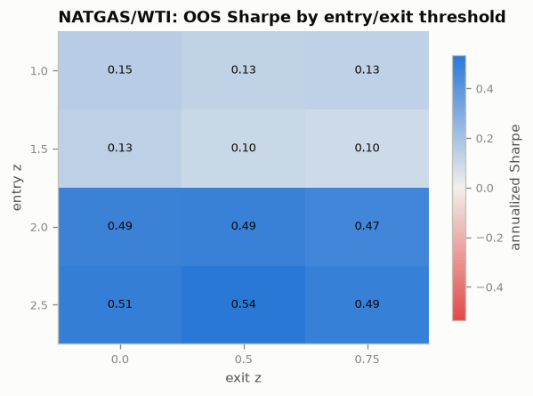


### Cost sensitivity


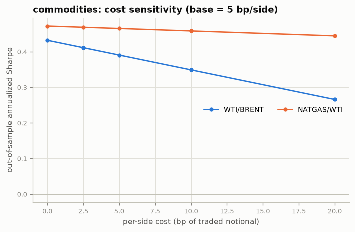


### Does the cointegration gate persist?

Fraction of formation windows passing the gate, and the probability of passing again next window given a pass now (Clegg 2014 asks whether the second number beats the first):

| pair       |   windows |   pass_rate |   p_pass_given_pass |
|:-----------|----------:|------------:|--------------------:|
| WTI/BRENT  |    141.00 |        0.30 |                0.58 |
| NATGAS/WTI |    114.00 |        0.15 |                0.53 |


<!-- generated by `pairs run --study cross` -->

## Cross

Featured pairs, default rule (enter 2σ / exit 0 / stop 4σ, 252d formation, 63d trading, next-close execution, 12 bp/side):

|          |   sharpe |   cagr_pct |   ann_vol_pct |   max_dd_pct |   n_trades |   win_rate_pct |   avg_trade_bp |   converged_pct |   nw_tstat |   gate_pass_pct |   years |
|:---------|---------:|-----------:|--------------:|-------------:|-----------:|---------------:|---------------:|----------------:|-----------:|----------------:|--------:|
| CAD/WTI  |     0.23 |       0.29 |          1.31 |         4.80 |      19.00 |          68.42 |          54.96 |           63.16 |       1.72 |            8.51 |   35.19 |
| BTC/PAXG |    -0.60 |      -4.66 |          7.45 |        33.02 |       3.00 |           0.00 |       -1092.71 |           33.33 |      -1.64 |            6.06 |    8.08 |


### Universe screen (cross)

9 assets, 1990-01-02 → 2026-08-25; 5 pairs pass the correlation prefilter (≥ 0.3); 2 of them reject the Engle-Granger null at 5%. With 36 candidate pairs, ≈ 2 would pass at 5% by pure chance (Clegg 2014), so this screen is *descriptive*: performance claims come only from the walk-forward section below.

|           |   corr |   eg_pvalue |   beta |   half_life |   hurst |    n_obs |
|:----------|-------:|------------:|-------:|------------:|--------:|---------:|
| WTI/BRENT |  0.629 |       0.000 |  0.906 |       8.878 |   0.208 | 9119.000 |
| AUD/CAD   |  0.586 |       0.040 |  1.129 |     186.135 |   0.450 | 9195.000 |
| ETH/BTC   |  0.615 |       0.064 |  1.249 |     256.578 |   0.567 | 3942.000 |
| AUD/NOK   |  0.518 |       0.424 |  0.562 |     505.589 |   0.463 | 9195.000 |
| CAD/NOK   |  0.463 |       0.472 |  0.453 |     617.703 |   0.446 | 9195.000 |

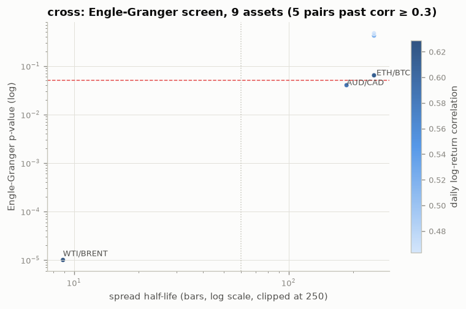


### CAD/WTI

Full-sample descriptives: EG p=0.627, β=0.12, half-life=548.1 bars, Hurst=0.43, n=9121. Walk-forward gate open 9% of 141 windows.


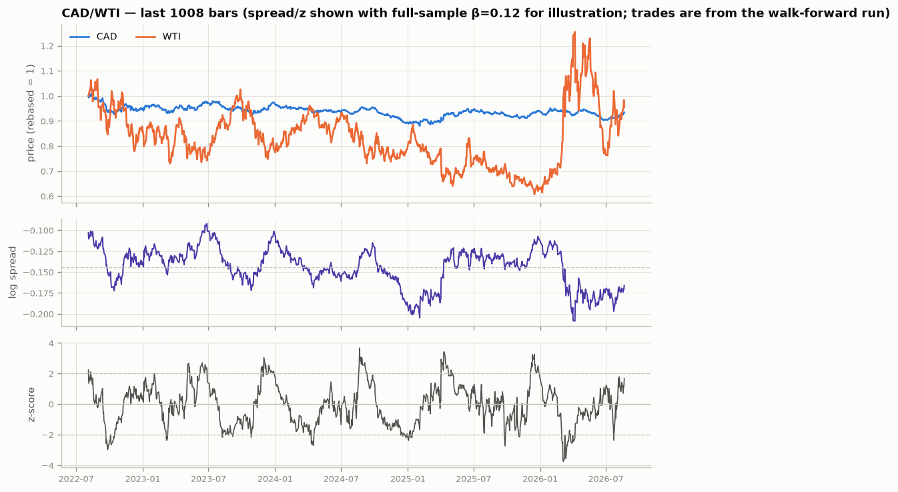


Method variants (all out-of-sample, base costs 12 bp/side):

|                              |   sharpe |   cagr_pct |   max_dd_pct |   n_trades |   win_rate_pct |   avg_trade_bp |   nw_tstat |   gate_pass_pct |   exposure_pct |
|:-----------------------------|---------:|-----------:|-------------:|-----------:|---------------:|---------------:|-----------:|----------------:|---------------:|
| OLS + rolling z (default)    |     0.23 |       0.29 |         4.80 |      19.00 |          68.42 |          54.96 |       1.72 |            8.51 |           2.67 |
| OLS + frozen z (GGR)         |     0.20 |       0.30 |         4.84 |       9.00 |          77.78 |         119.76 |       1.59 |            8.51 |           3.53 |
| Kalman hedge                 |     0.12 |       0.06 |         1.30 |       3.00 |          66.67 |          65.30 |       0.93 |            2.13 |           0.39 |
| same-close execution (lag 0) |     0.36 |       0.47 |         3.33 |      20.00 |          70.00 |          82.57 |       2.35 |            8.51 |           2.76 |
| no gate                      |     0.06 |       0.14 |        21.69 |     124.00 |          55.65 |           6.00 |       0.38 |          100.00 |          28.37 |


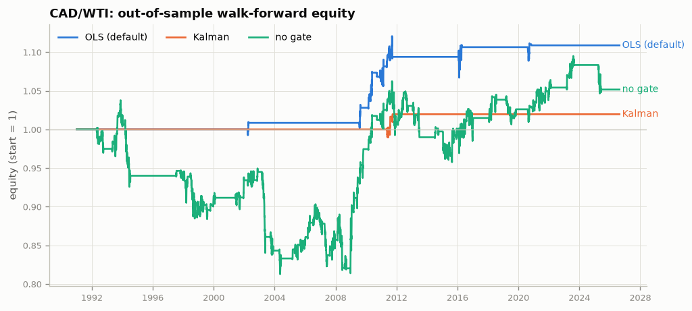


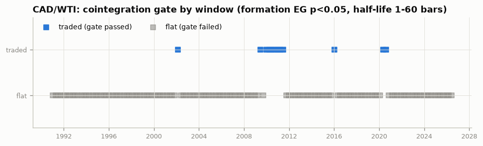


Threshold sensitivity (12 configurations). Deflated Sharpe probability of the default cell, accounting for this grid search: **0.81**.


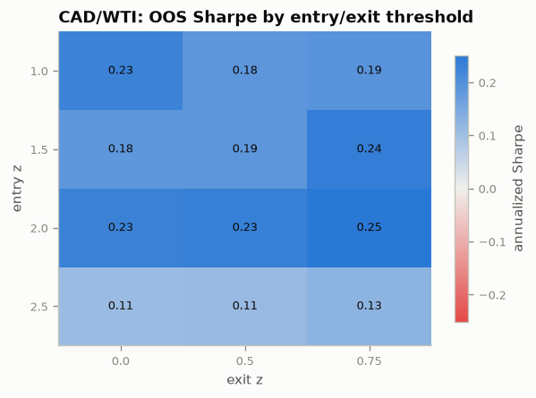


### BTC/PAXG

Full-sample descriptives: EG p=0.653, β=1.68, half-life=297.3 bars, Hurst=0.56, n=2290. Walk-forward gate open 6% of 33 windows.


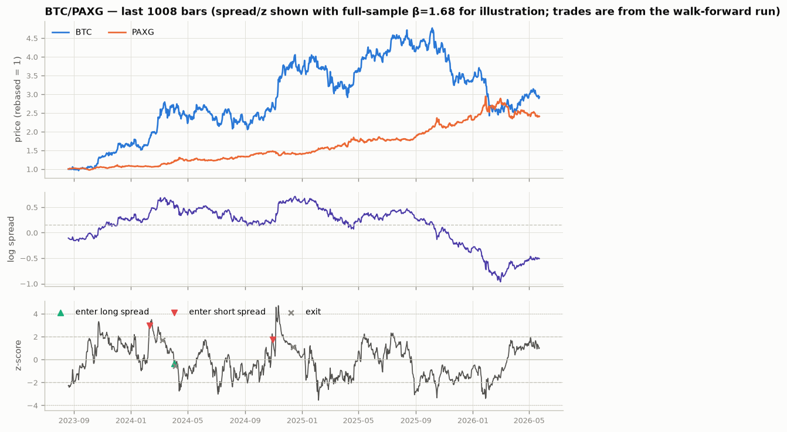


Method variants (all out-of-sample, base costs 12 bp/side):

|                              |   sharpe |   cagr_pct |   max_dd_pct |   n_trades |   win_rate_pct |   avg_trade_bp |   nw_tstat |   gate_pass_pct |   exposure_pct |
|:-----------------------------|---------:|-----------:|-------------:|-----------:|---------------:|---------------:|-----------:|----------------:|---------------:|
| OLS + rolling z (default)    |    -0.60 |      -4.66 |        33.02 |       3.00 |           0.00 |       -1092.71 |      -1.64 |            6.06 |           3.63 |
| OLS + frozen z (GGR)         |    -0.47 |      -1.20 |         9.37 |       4.00 |          25.00 |        -234.09 |      -1.30 |            6.06 |           2.06 |
| Kalman hedge                 |    -0.36 |      -3.34 |        27.73 |      27.00 |          44.44 |         -92.81 |      -1.17 |           72.73 |          18.35 |
| same-close execution (lag 0) |    -0.62 |      -4.80 |        32.82 |       3.00 |           0.00 |       -1137.84 |      -1.68 |            6.06 |           3.73 |
| no gate                      |    -0.92 |     -13.04 |        67.67 |      24.00 |          50.00 |        -405.35 |      -2.65 |          100.00 |          35.87 |


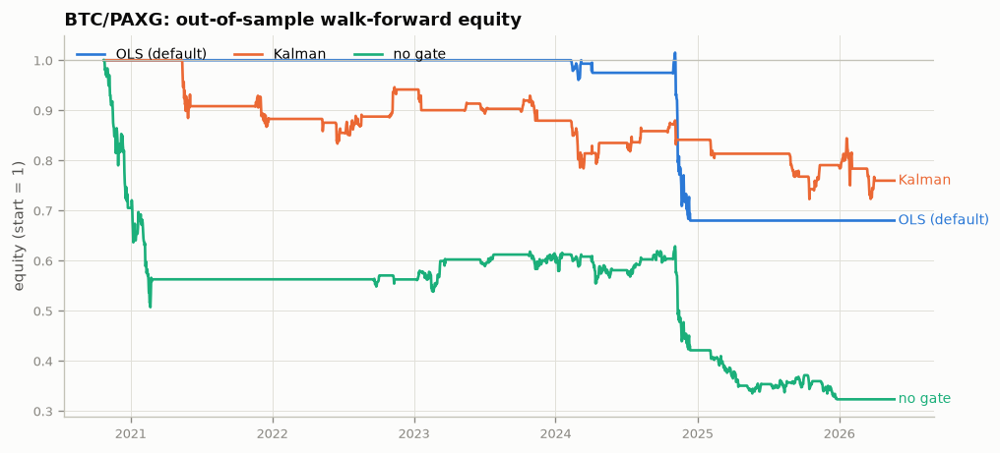


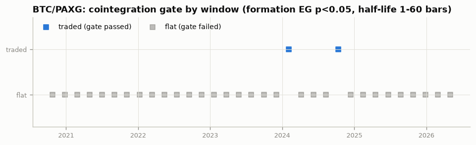


Threshold sensitivity (12 configurations). Deflated Sharpe probability of the default cell, accounting for this grid search: **0.01**.


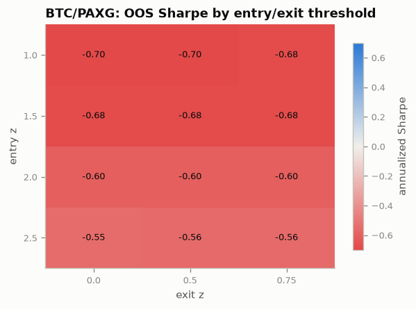


### Cost sensitivity


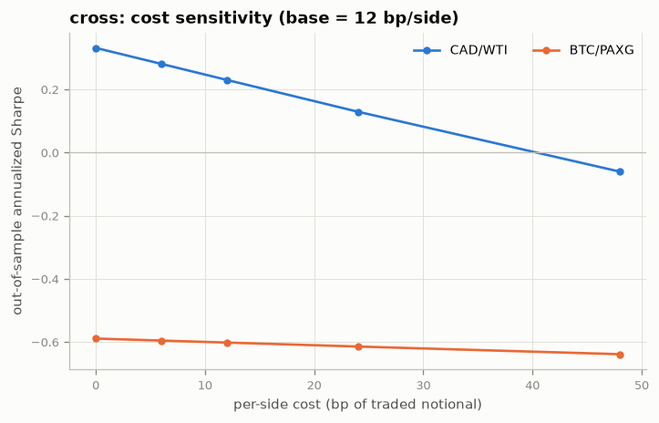


### Does the cointegration gate persist?

Fraction of formation windows passing the gate, and the probability of passing again next window given a pass now (Clegg 2014 asks whether the second number beats the first):

| pair     |   windows |   pass_rate |   p_pass_given_pass |
|:---------|----------:|------------:|--------------------:|
| CAD/WTI  |    141.00 |        0.09 |                0.58 |
| BTC/PAXG |     33.00 |        0.06 |                0.00 |


## Cross-check against backtesting.py

The same z-score rule, run through the bundled `backtesting.py` engine on the *price-ratio* approximation (single instrument, beta=1, next-open execution, 2x per-side commission), against the two-leg engine on the same ratio signals. The two implementations are independent, so agreement on trade count and return sign validates the signal/timing plumbing; level differences reflect the documented approximation.

|                          |   return_pct |   sharpe |   max_dd_pct |   n_trades |   win_rate_pct |
|:-------------------------|-------------:|---------:|-------------:|-----------:|---------------:|
| KO/PEP backtesting.py    |        19.25 |     0.41 |        12.79 |      20.00 |          75.00 |
| KO/PEP two-leg engine    |        10.60 |     0.51 |         5.18 |      20.00 |          75.00 |
| WTI/BRENT backtesting.py |      1727.66 |     0.37 |        34.79 |     234.00 |          67.52 |
| WTI/BRENT two-leg engine |       304.57 |     0.42 |        20.24 |     233.00 |          66.09 |

*(Note: this cross-check is a full-sample single split with a rolling z — it validates plumbing, not performance; both runs here share the same in-sample caveats.)*


## Limitations and honest caveats

- **Indicative marks, not tradable quotes.** FX fixings (Fed H.10), EIA spot
  assessments and Coin Metrics reference rates are mid-market marks. Spot oil
  and gas are not directly tradable (futures carry roll yield the spot series
  ignores) — commodity results measure statistical structure more than
  bookable P&L.
- **Survivorship.** The S&P 500 panel is the 2018 constituent list projected
  back 5 years, and the crypto panel contains today's major coins; both
  universes omit delisted assets. The featured *pairs* are additionally
  famous ex post — that is exactly why every class also gets a mechanical
  screen and (where the universe is large) a walk-forward portfolio whose
  selections use no hindsight.
- **Shorting is assumed free.** No borrow fees on the short stock leg
  (~25-50 bp/yr for general collateral, worse in squeezes), no crypto margin
  interest or funding, no FX swap points. These subtract roughly 0.3-1 Sharpe
  hundredths to tenths depending on class and exposure.
- **Dividends.** The 5-year equity panel is split- but not dividend-adjusted;
  long/short same-sector pairs offset most, not all, of the effect. The
  1990-2018 panel is fully adjusted.
- **Daily bars only.** The literature (Fil & Kristoufek 2020 for crypto;
  intraday equity studies) finds most surviving pairs alpha at intraday
  horizons, which this dataset cannot reach.
- **Multiple testing.** Even walk-forward results were produced once per
  configuration grid; deflated Sharpe numbers quantify, but cannot eliminate,
  selection effects. Treat |t| < 3 as "not established" (Harvey, Liu & Zhu
  2016).

## References

- Gatev, Goetzmann & Rouwenhorst (2006), *Pairs Trading: Performance of a
  Relative-Value Arbitrage Rule*, RFS 19(3).
- Do & Faff (2010), *Does Simple Pairs Trading Still Work?*, FAJ 66(4); and
  (2012) *Are Pairs Trading Profits Robust to Trading Costs?*, JFR 35(2).
- Vidyamurthy (2004), *Pairs Trading: Quantitative Methods and Analysis*.
- Engle & Granger (1987), *Co-integration and Error Correction*, Econometrica.
- Avellaneda & Lee (2010), *Statistical Arbitrage in the US Equities Market*,
  Quantitative Finance 10(7).
- Chan (2013), *Algorithmic Trading: Winning Strategies and Their Rationale*.
- Clegg (2014), *On the Persistence of Cointegration in Pairs Trading*, SSRN.
- Rad, Low & Faff (2016), *The Profitability of Pairs Trading Strategies*,
  Quantitative Finance 16(10).
- Krauss (2017), *Statistical Arbitrage Pairs Trading Strategies: Review and
  Outlook*, Journal of Economic Surveys 31(2).
- Bailey & López de Prado (2014), *The Deflated Sharpe Ratio*, JPM 40(5).
- Harvey, Liu & Zhu (2016), *…and the Cross-Section of Expected Returns*, RFS.
- Fil & Kristoufek (2020), *Pairs Trading in Cryptocurrency Markets*, IEEE
  Access 8.


## Reproduction

```
uv sync
uv run pairs all        # or: pairs run --study crypto|stocks|forex|commodities|cross
uv run pairs report
```

Study data ranges: commodities 1990-01-02→2026-08-25 (3 assets); cross 1990-01-02→2026-08-25 (9 assets); crypto 2016-01-01→2026-05-23 (13 assets); forex 1999-01-04→2026-08-21 (11 assets); stocks 2013-02-08→2018-02-07 (505 assets).


*Report generated 2026-09-06 19:31 UTC.*
